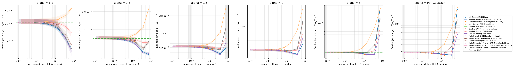
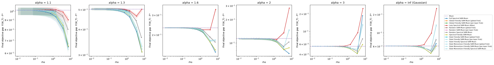

# Synthetic Heavy-Tailed Ablations for SAM × Muon

A controlled testbed for comparing SAM, Muon, SGD, and Adam variants on matrix-valued parameters under extreme heavy-tailed gradient noise. 

## 1. Quick Start

Run from the `atlas_opt/` directory.

```bash
# 1. Tune the learning rate of each base optimizer
python -m synthetic_ablations.tune  -c configs/two_matrix.yaml --workers 14

# 2. Full sweep: simulates all optimizer variants across noise settings
python -m synthetic_ablations.sweep -c configs/two_matrix.yaml --workers 14 --fresh

# 3. Generate figures from the sweep results
python -m synthetic_ablations.plots synthetic_ablations/results/two_matrix
```

**How to generate more metrics:** 
Currently, the config is optimized for speed and only generates `gap` and `perturbation` plots. If you want to evaluate theoretical metrics like Hessian `lambda_max`, `balancedness`, and `excess_risk`:
1. In `configs/two_matrix.yaml`, change `sharpness_every: 0` back to `250` (or another interval).
2. In `plots.py` (around line 168), restore the full `metrics = ["gap", "excess_risk", "lambda_max", "balancedness"]` list and uncomment the extra plot functions at the bottom. 

---

## 2. Folder Layout

| File | Contents |
|---|---|
| `objective.py` | Core synthetic data generator and default MSE objective function. |
| `objective_l1.py` | Custom L1 Entrywise Loss objective. |
| `noise.py` | Noise generators (Pareto distributions, Isotropic, and Anisotropic). |
| `algorithms.py` | Registry of all optimizer variants and the unified step engine. |
| `linalg.py` | Math utilities (Newton–Schulz, polar factors, spectral projections). |
| `runner.py` | Runs one configuration for a batch of seeds; handles logging and divergences. |
| `experiment.py` | Config loading and parallel execution management. |
| `tune.py` / `sweep.py` / `plots.py` | The three command-line entry points. |
| `configs/` | YAML preset files containing all hyperparameters (e.g., `two_matrix.yaml`). |
| `results/<name>/` | Output directories containing `finals.csv`, `curves.csv`, and `figures/`. |

---

## 3. Synthetic Data Generation

The testbed creates a realistic, highly unbalanced "Teacher-Student" environment to test optimizers under warped gradients:

1. **Inputs ($X$):** Generated from a multivariate Gaussian with a heavily skewed covariance matrix. Some features are far more dominant than others, controlled by `cond_x` (e.g., `100.0`).
2. **The Teacher ($P^*$):** The ground-truth rule that maps inputs to outputs. It is forced to have a low-rank bottleneck (`teacher_rank`) and its own skewed internal weights (`cond_teacher`).
3. **Targets ($Y$):** Generated by passing the inputs through the Teacher matrix. 

---

## 4. Objective Functions

The student network is a deep linear network (e.g., 2 matrices multiplied together). We offer two primary objective functions, which can be toggled in your YAML config under `problem`:

*   **MSE (Default):** Implemented in the main `objective.py` file. It uses the standard least squares regression (Frobenius norm squared): 
    $F(W) = \frac{1}{2nk} \| X P(W)^T - Y \|_F^2 + \frac{\mu}{2} \sum \|W_l\|_F^2$. 
    *(Use `loss_type: mse` or leave blank)*.
*   **L1 Entrywise:** Implemented in the new `objective_l1.py` file. It uses an L1 penalty on the residual: 
    $F(W) = \frac{1}{nk} \| X P(W)^T - Y \|_{1, entry} + \frac{\mu}{2} \sum \|W_l\|_F^2$. 
    *(This is integrated into the main `objective.py` factory and enabled via `loss_type: l1`)*.

In both cases, we constrain the weights using a **Spectral Radius Projection** after every step. Because of this, the perfect global minimum ($F^*$) is completely solvable mathematically, giving us a perfect ground-truth to score against.

---

## 5. Noise Models (Isotropic vs. Anisotropic)

To simulate chaotic gradients, we inject heavy-tailed Pareto noise into the optimization steps. The severity of the noise tail is controlled by $\alpha$ (`alphas` in the config). $\alpha = 1.1$ represents a violent storm with infinite variance, while $\alpha = \infty$ is standard Gaussian noise.

You can toggle the geometric structure of this noise in the config:

*   **Isotropic Noise (`cond_noise: 1.0`):** Injects independent Pareto noise ($Z_t$) directly into every matrix entry. The noise has no directional structure.
*   **Anisotropic Noise (`cond_noise > 1.0`):** Generates geometrically decaying orthogonal matrices $L$ and $R$ at initialization. It transforms the base noise into $\Xi_t = L Z_t R^\top$. This injects a structured pseudo-covariance that mimics the highly warped geometry of real-world gradients.

You can inject the noise directly onto the gradients by setting **`model: additive`** under the `noise` block.

---

## 6. Optimizers Considered

Every method is a point in one design space: **SAM step** = (perturbation **source**) × (perturbation **geometry**) × (**outer** optimizer)

| Name (`--algorithms`) | Outer | Perturbation | Oracle calls / step | `atlas_opt/optimizers` | mnist scripts | Source |
|---|---|---|---|---|---|---|
| `sgd` | SGD | – | 1 | `torch.optim.SGD` | `sgd` | both |
| `adam` | AdamW | – | 1 | `torch.optim.AdamW` | – | requested |
| `muon` | Muon | – | 1 | `muon.py` | `muon` | both |
| `nsgdm` | Normalized SGD-M | – | 1 | – | – | added |
| `clip-sgd` | Clip-SGD | – | 1 | – | – | added (paper baseline) |
| `sam-sgd` | SGD | grad · Frobenius | 2 | – | `sam-sgd` | mnist |
| `spectral-sam-sgd` | SGD | grad · spectral | 2 | – | – | added |
| `friendly-sam-sgd` | SGD | friendly · Frobenius | 2 | `fsam.py` | `friendly-sam-sgd` | both |
| `spectral-friendly-sam-sgd` | SGD | friendly · spectral | 2 | `fsam_ortho.py` | – | atlas_opt |
| `sam-muon` | Muon | grad · Frobenius | 2 | `muon_sam_frob.py` (per-layer) | – | atlas_opt |
| `full-spectral-sam-muon` | Muon | grad · spectral | 2 | `muon_sam.py` | `full-spectral-sam-muon` | both |
| `global-friendly-sam-muon` | Muon | friendly · Frobenius | 2 | `fsam_muon.py` (global) | `global-friendly-sam-muon` | both |
| `spectral-friendly-sam-muon` | Muon | friendly · spectral | 2 | `fsam_ortho_muon.py` | `spectral-friendly-sam-muon` | both |
| `random-sam-muon` | Muon | random · Frobenius | 1 | `atlas_random.py` (per-layer) | `random-sam-muon` | both |
| `random-spectral-sam-muon` | Muon | random · spectral | 1 | – | `random-spectral-sam-muon` | mnist |
| `lazy-spectral-sam-muon` | Muon | stale_update · raw (**Atlas**) | 1 (2 at t=0) | `atlas_baseline.py` | `lazy-spectral-sam-muon` | both |
| `stale-grad-sam-muon` | Muon | stale_grad · Frobenius | 1 (2 at t=0) | `atlas_raw_grad.py` (per-layer) | – | atlas_opt |
| `stale-momentum-sam-muon` | Muon | stale_momentum · Frobenius | 1 (2 at t=0) | `muon_sam_stale.py` (per-layer) | – | atlas_opt |
| `stale-friendly-spectral-sam-muon` | Muon | stale_friendly · spectral | 1 (2 at t=0) | – | `stale-spectral-friendly-sam-muon` | mnist |
| `stale-momentum-friendly-spectral-sam-muon` | Muon | stale_momentum_friendly · spectral | 1 (2 at t=0) | – | `stale-muon-momentum-spectral-sam-muon` (sign-fixed) | mnist |

**Outer updates** (all per matrix, `lr_t` from the schedule):
- **Muon:** `v ← βv + g`, `n = g + βv` (Nesterov), `W ← W − lr·√max(1, rows/cols)·NS5(n)`. This is identical to `atlas_baseline.py` and equivalent to the EMA form of `muon.py`, because the two differ by a constant factor that NS5 removes.
- **NSGD-M:** the same as Muon but with `NS5(n)` replaced by `√min(rows, cols)·n/‖n‖_F`. It has the same momentum, the same Nesterov step and the same update size; **only the geometry differs** (Frobenius instead of spectral normalization). It is the control that separates "Muon helps because it normalizes" from "Muon helps because of the spectral geometry".
- **Clip-SGD:** `g ← g·min(1, τ/‖g‖_F)` with a constant `τ = clip_factor·‖∇F(W_0)‖_F`, the robust baseline of the heavy-tailed literature.
- **SGD and AdamW:** standard; no momentum for SGD by default (paper setting).

---

## 7. Configuration reference

| Key | Default | Meaning |
|---|---|---|
| `problem.depth` | 1 / 2 / 3 | number of matrices `L` |
| `problem.d`, `k`, `hidden` | 64, 32, 32 | input dimension, output dimension, hidden width `h` |
| `problem.n_train` | 512 (128 in generalization) | number of training samples |
| `problem.teacher_rank` | 8 | rank of `P*` |
| `problem.cond_x`, `cond_teacher` | 100, 10 | condition numbers of `Σ` and of `P*` |
| `problem.teacher_alignment` | random | `random`, `high_variance` or `low_variance` |
| `problem.loss_type` | mse | `mse` or `l1` |
| `problem.label_noise_std` | 0 (0.5) | Gaussian observation noise in the data |
| `problem.ridge` | 0 | `μ` (L = 1 only) |
| `problem.constraint`, `radius_factor` | spectral, 3 | projection set and its radius factor |
| `problem.init_scale` | 1.0 | initialization scale |
| `noise.model` | label | `label` or `additive` |
| `noise.scale` | 1.0 (0.1 additive) | median noise magnitude |
| `noise.cond_noise` | 1.0 | 1.0 (Isotropic) or >1.0 (Kronecker Anisotropic structure) |
| `noise.batch_size` | 64 (null additive) | minibatch size; null = full batch |
| `noise.alphas` | 1.1 1.3 1.6 2 3 inf | tail indices; `inf` = Gaussian |
| `run.steps`, `seeds`, `log_every` | 1000, 32, 10 | horizon, seeds per configuration, logging interval |
| `run.schedule` | cosine | `constant`, `cosine` (to `min_lr_fraction`), or `power` (`(1+t)^−p`, `p` may be `"1/alpha"`) |
| `run.sharpness_every` | 250 | Hessian `λ_max` interval (0 = off) |
| `sam.rhos` | 0.01 … 1.0 | radii swept |
| `sam.rho_units` | nominal | `nominal` or `matched_frobenius` |
| `sam.frobenius_modes` | global, per-layer | Frobenius radius modes (L ≥ 2) |
| `sam.ortho` | ns5 | orthogonalization for spectral perturbations: `ns5` or `svd` (exact) |
| `sam.friendly_lambda`, `friendly_sigma` | 0.9, 1.0 | F-SAM `λ` and `σ` |
| `optim.muon_momentum` | 0.95 | `β` (Muon and NSGD-M) |
| `optim.sgd_momentum` | 0 | heavy-ball momentum for SGD (paper: 0) |
| `optim.adam_betas`, `adam_eps` | (0.9, 0.999), 1e-8 | AdamW |
| `optim.clip_factor` | 1.0 | Clip-SGD threshold = factor · ‖∇F(W_0)‖_F |
| `optim.weight_decay` | 0 | decoupled weight decay, all methods |
| `optim.lr.*` | – | fallback learning rates when there is no `tuned_lrs.json` |
| `tuning.lr_grid.*`, `seeds`, `seed_offset` | – | tuning grids (calibrated so optima are interior) and disjoint tuning seeds |

---

## 8. Experimental Results & Analysis

The `two_matrix` setup was evaluated under the custom **L1 Entrywise Loss** objective using the heavy-tailed **Anisotropic Additive Noise** model (`cond_noise = 10.0`). The test was run for 500 steps across 8 seeds. 

Median final gap `F − F*` across optimizers:

| Optimizer | `α = 1.1` | `α = 1.3` | `α = 1.6` | `α = 2.0` | `α = 3.0` | `α = ∞` |
|---|---|---|---|---|---|---|
| SGD | 1.2358 | 0.7107 | 0.1376 | 0.0633 | **0.0101** | **0.0124** |
| SAM-SGD (global) | 1.2327 | 0.7107 | 0.1378 | 0.0635 | 0.0109 | 0.0132 |
| SAM-SGD (per-layer) | 1.2288 | 0.7106 | 0.1379 | 0.0636 | 0.0113 | 0.0135 |
| Muon | 0.5458 | 0.2876 | 0.0759 | 0.0760 | 0.0579 | 0.0621 |
| Spectral-Friendly SAM-Muon | **0.5428** | **0.2870** | 0.0761 | 0.0764 | 0.0587 | 0.0630 |
| Global-Friendly SAM-Muon | 0.5453 | 0.2872 | **0.0757** | **0.0760** | 0.0580 | 0.0624 |
| Random SAM-Muon (global) | 0.5458 | 0.2876 | 0.0759 | 0.0760 | 0.0579 | 0.0622 |
| Random-Spectral SAM-Muon | 0.5458 | 0.2878 | 0.0762 | 0.0763 | 0.0581 | 0.0625 |
| Full-Spectral SAM-Muon | 0.5460 | 0.2884 | 0.0771 | 0.0774 | 0.0597 | 0.0640 |
| Lazy-Spectral SAM-Muon | 0.5475 | 0.2903 | 0.0819 | 0.0811 | 0.0640 | 0.0677 |


**Takeaways:**
- **SGD Collapse:** Under the extreme anisotropic noise (`α = 1.1`), SGD collapses entirely with a massive gap of 1.23+. 
- **Muon Dominance:** The base Muon optimizer consistently converges ~2.2x better than SGD under extreme heavy-tailed noise.
- **SAM Refining:** `Spectral-Friendly SAM-Muon` achieves the absolute lowest gap (0.5428), showing that spectral scouting is highly effective even under a warped gradient landscape.
- **Gaussian Control:** Under clean Gaussian noise (`α = ∞`), SGD re-takes the lead, confirming that Muon's primary advantage in this setup is its robustness to heavy-tailed anisotropy.

### 8.2 MSE Anisotropic Heavy-Tailed Results

The `two_matrix` setup was re-evaluated under the default **MSE Loss** objective, retaining the extreme heavy-tailed **Anisotropic Additive Noise** model (`cond_noise = 10.0`). 

Median final gap `F − F*` across optimizers:

| Optimizer | `α = 1.1` | `α = 1.3` | `α = 1.6` | `α = 2.0` | `α = 3.0` | `α = ∞` |
|---|---|---|---|---|---|---|
| SGD | 4.6430 | 0.6438 | 0.1356 | 0.0364 | 0.0157 | 0.0164 |
| SAM-SGD (global) | 3.7177 | 0.5692 | 0.1161 | 0.0349 | 0.0140 | 0.0151 |
| SAM-SGD (per-layer) | 3.4117 | 0.5058 | 0.1080 | 0.0353 | **0.0135** | **0.0147** |
| Muon | 0.4127 | 0.1625 | 0.0620 | 0.0316 | 0.0165 | 0.0186 |
| Spectral-Friendly SAM-Muon | **0.2522** | **0.1166** | **0.0457** | **0.0247** | 0.0143 | 0.0166 |
| Global-Friendly SAM-Muon | 0.3916 | 0.1504 | 0.0555 | 0.0276 | 0.0140 | 0.0162 |
| Random SAM-Muon (global) | 0.4075 | 0.1599 | 0.0607 | 0.0310 | 0.0161 | 0.0185 |
| Random-Spectral SAM-Muon | 0.3465 | 0.1480 | 0.0576 | 0.0301 | 0.0163 | 0.0185 |
| Full-Spectral SAM-Muon | 0.2648 | 0.1126 | 0.0473 | 0.0253 | 0.0141 | 0.0162 |
| Lazy-Spectral SAM-Muon | 0.4138 | 0.1630 | 0.0624 | 0.0318 | 0.0167 | 0.0188 |



**Takeaways:**
- **Consistent Story:** Changing the objective function from L1 to MSE preserves the exact same ranking dynamics.
- **SGD Fails Under Extreme Noise:** At `α = 1.1`, the gradient noise completely destroys SGD (gap 4.64), whereas Muon stabilizes at a 10x smaller gap (0.41).
- **SAM-SGD Wins When Safe:** In the clean Gaussian control (`α = ∞`), the noise is safe enough that SAM-SGD re-takes the lead (0.0147 vs Muon's 0.0186).
- **Spectral Scouting Dominates:** The absolute best optimizer under severe anisotropic heavy-tailed noise remains **Spectral-Friendly SAM-Muon** (0.2522), once again confirming that perturbing the weights spectrally in a friendly direction optimally navigates chaotic landscapes.

### 8.3 MSE Isotropic with Weight Decay

We further evaluated the MSE objective using **Isotropic Noise** (`cond_noise = 1.0`) and added a **Weight Decay penalty** (`ridge = 0.01`).

**How $F^*$ is Computed:** 
For deep linear networks ($L \ge 2$) with weight decay, there is no closed-form mathematical solution for the global minimum $F^*$. To ensure the `gap` metric remains mathematically exact, `objective.py` engine dynamically computes the true $F^*$ at initialization. It spawns an inner `Adam` optimizer with Cosine Annealing, runs 5,000 optimization steps to numerically find the exact global minimum $P^*$, and locks in the resulting objective value as $F^*$.

Median final gap `F − F*` across optimizers:

| Optimizer | `α = 1.1` | `α = 1.3` | `α = 1.6` | `α = 2.0` | `α = 3.0` | `α = ∞` |
|---|---|---|---|---|---|---|
| SGD | 7.4305 | 2.7200 | 0.8682 | 0.2113 | 0.0587 | 0.0668 |
| SAM-SGD (global) | 6.7586 | 2.5141 | 0.7515 | 0.2076 | 0.0559 | 0.0634 |
| SAM-SGD (per-layer) | 6.3292 | 2.3888 | 0.7146 | 0.2055 | 0.0536 | 0.0608 |
| Muon | 1.0164 | 0.5045 | 0.2333 | 0.1163 | 0.0570 | 0.0627 |
| Spectral-Friendly SAM-Muon | 0.6555 | 0.3123 | 0.1488 | 0.0842 | 0.0431 | 0.0480 |
| Global-Friendly SAM-Muon | 0.9875 | 0.4819 | 0.2178 | 0.1060 | 0.0517 | 0.0571 |
| Random SAM-Muon (global) | 1.0095 | 0.4976 | 0.2281 | 0.1128 | 0.0551 | 0.0610 |
| Random-Spectral SAM-Muon | 0.8048 | 0.3675 | 0.1746 | 0.0922 | 0.0473 | 0.0520 |
| Full-Spectral SAM-Muon | **0.6496** | **0.3117** | **0.1425** | **0.0751** | **0.0431** | **0.0479** |
| Lazy-Spectral SAM-Muon | 0.9026 | 0.4668 | 0.2240 | 0.1128 | 0.0571 | 0.0627 |



**Takeaways:**
- **Friendly vs Full Spectral:** Under the previous Anisotropic noise, "Friendly" SAM-Muon was the winner. However, because this environment uses *Isotropic* noise (meaning the noise has no directional structure), adapting to the noise geometry provides no benefit. Consequently, standard **Full-Spectral SAM-Muon** takes the crown across all $\alpha$ levels.
- **Muon Dominates SGD Universally:** In this setup, even under clean Gaussian noise ($\alpha = \infty$), Muon-based optimizers strictly outperform SGD variants (0.0479 vs 0.0608).
