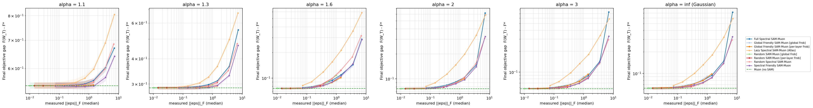
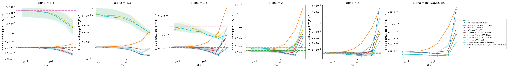
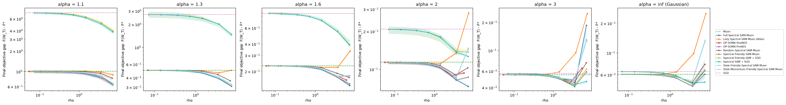
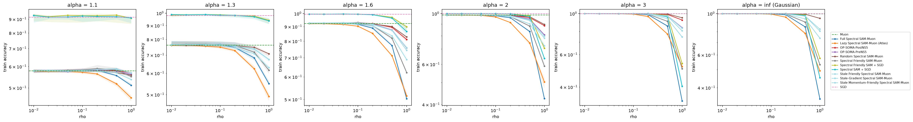
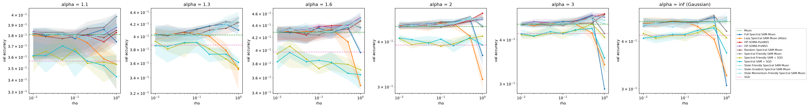
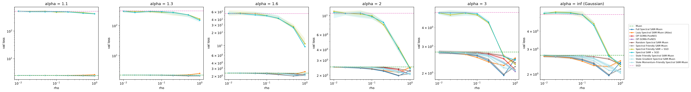
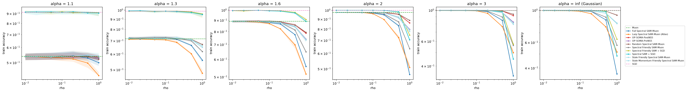
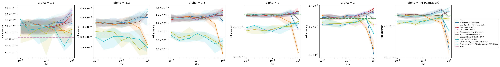
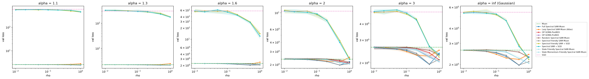

# Synthetic Heavy-Tailed Ablations for SAM × Muon

A controlled testbed for comparing SAM, Muon, SGD, and Adam variants on matrix-valued parameters under extreme heavy-tailed gradient noise. 

## 1. Quick Start

Run from the `atlas_opt/` directory.

```bash
# 1. Tune the learning rate of each base optimizer
python -m synthetic_ablations.tune  -c configs/two_matrix.yaml --workers 14

# 2. Full sweep: simulates all optimizer variants across noise settings
python -m synthetic_ablations.sweep -c configs/two_matrix.yaml --workers 14 --fresh

# 3. Generate figures from the sweep results
python -m synthetic_ablations.plots synthetic_ablations/results/two_matrix
```

**How to generate more metrics:** 
Currently, the config is optimized for speed and only generates `gap` and `perturbation` plots. If you want to evaluate theoretical metrics like Hessian `lambda_max`, `balancedness`, and `excess_risk`:
1. In `configs/two_matrix.yaml`, change `sharpness_every: 0` back to `250` (or another interval).
2. In `plots.py` (around line 168), restore the full `metrics = ["gap", "excess_risk", "lambda_max", "balancedness"]` list and uncomment the extra plot functions at the bottom. 

---

## 2. Folder Layout

| File | Contents |
|---|---|
| `objective.py` | Core synthetic data generator and default MSE objective function. |
| `objective_l1.py` | Custom L1 Entrywise Loss objective. |
| `noise.py` | Noise generators (Pareto distributions, Isotropic, and Anisotropic). |
| `algorithms.py` | Registry of all optimizer variants and the unified step engine. |
| `linalg.py` | Math utilities (Newton–Schulz, polar factors, spectral projections). |
| `runner.py` | Runs one configuration for a batch of seeds; handles logging and divergences. |
| `experiment.py` | Config loading and parallel execution management. |
| `tune.py` / `sweep.py` / `plots.py` | The three command-line entry points. |
| `configs/` | YAML preset files containing all hyperparameters (e.g., `two_matrix.yaml`). |
| `results/<name>/` | Output directories containing `finals.csv`, `curves.csv`, and `figures/`. |

---

## 3. Synthetic Data Generation

The testbed creates a realistic, highly unbalanced "Teacher-Student" environment to test optimizers under warped gradients:

1. **Inputs ($X$):** Generated from a multivariate Gaussian with a heavily skewed covariance matrix. Some features are far more dominant than others, controlled by `cond_x` (e.g., `100.0`).
2. **The Teacher ($P^*$):** The ground-truth rule that maps inputs to outputs. It is forced to have a low-rank bottleneck (`teacher_rank`) and its own skewed internal weights (`cond_teacher`).
3. **Targets ($Y$):** Generated by passing the inputs through the Teacher matrix. 

---

## 4. Objective Functions

The student network is a deep linear network (e.g., 2 matrices multiplied together). We offer two primary objective functions, which can be toggled in your YAML config under `problem`:

*   **MSE (Default):** Implemented in the main `objective.py` file. It uses the standard least squares regression (Frobenius norm squared): 
    $F(W) = \frac{1}{2nk} \| X P(W)^T - Y \|_F^2 + \frac{\mu}{2} \sum \|W_l\|_F^2$. 
    *(Use `loss_type: mse` or leave blank)*.
*   **L1 Entrywise:** Implemented in the new `objective_l1.py` file. It uses an L1 penalty on the residual: 
    $F(W) = \frac{1}{nk} \| X P(W)^T - Y \|_{1, entry} + \frac{\mu}{2} \sum \|W_l\|_F^2$. 
    *(This is integrated into the main `objective.py` factory and enabled via `loss_type: l1`)*.

In both cases, we constrain the weights using a **Spectral Radius Projection** after every step. Because of this, the perfect global minimum ($F^*$) is completely solvable mathematically, giving us a perfect ground-truth to score against.

*   **Neural-Network Cross-Entropy:** Implemented in `objective_nn.py`. Unlike the two objectives above, the student is a genuine nonlinear classifier -- a ReLU activation sits between the two matrices, and the loss is cross-entropy over $k$ classes rather than a residual norm:
    $F(W_1, W_2) = \frac{1}{n} \sum_{i=1}^n \mathrm{CE}(W_2 \cdot \mathrm{ReLU}(W_1 x_i), y_i) + \frac{\mu}{2} \left( \|W_1\|_F^2 + \|W_2\|_F^2 \right)$,
    where $y_i$ is the class label produced by a same-shaped teacher network. *(Enabled via `loss_type: nn_ce`, currently depth = 2 only; see 8.4 below.)* Because ReLU + cross-entropy has no closed-form global minimum, $F^*$ here is the teacher network's own achieved loss on the training data -- a genuine, directly-computed reference point, but not a provably-global one the way $F^*$ is for MSE/L1 above.

---

## 5. Noise Models (Isotropic vs. Anisotropic)

To simulate chaotic gradients, we inject heavy-tailed Pareto noise into the optimization steps. The severity of the noise tail is controlled by $\alpha$ (`alphas` in the config). $\alpha = 1.1$ represents a violent storm with infinite variance, while $\alpha = \infty$ is standard Gaussian noise.

You can toggle the geometric structure of this noise in the config:

*   **Isotropic Noise (`cond_noise: 1.0`):** Injects independent Pareto noise ($Z_t$) directly into every matrix entry. The noise has no directional structure.
*   **Anisotropic Noise (`cond_noise > 1.0`):** Generates geometrically decaying orthogonal matrices $L$ and $R$ at initialization. It transforms the base noise into $\Xi_t = L Z_t R^\top$. This injects a structured pseudo-covariance that mimics the highly warped geometry of real-world gradients.

You can inject the noise directly onto the gradients by setting **`model: additive`** under the `noise` block.

---

## 6. Optimizers Considered

Every method is a point in one design space: **SAM step** = (perturbation **source**) × (perturbation **geometry**) × (**outer** optimizer)

| Name (`--algorithms`) | Outer | Perturbation | Oracle calls / step | `atlas_opt/optimizers` | mnist scripts | Source |
|---|---|---|---|---|---|---|
| `sgd` | SGD | – | 1 | `torch.optim.SGD` | `sgd` | both |
| `adam` | AdamW | – | 1 | `torch.optim.AdamW` | – | requested |
| `muon` | Muon | – | 1 | `muon.py` | `muon` | both |
| `nsgdm` | Normalized SGD-M | – | 1 | – | – | added |
| `clip-sgd` | Clip-SGD | – | 1 | – | – | added (paper baseline) |
| `sam-sgd` | SGD | grad · Frobenius | 2 | – | `sam-sgd` | mnist |
| `spectral-sam-sgd` | SGD | grad · spectral | 2 | – | – | added |
| `friendly-sam-sgd` | SGD | friendly · Frobenius | 2 | `fsam.py` | `friendly-sam-sgd` | both |
| `spectral-friendly-sam-sgd` | SGD | friendly · spectral | 2 | `fsam_ortho.py` | – | atlas_opt |
| `sam-muon` | Muon | grad · Frobenius | 2 | `muon_sam_frob.py` (per-layer) | – | atlas_opt |
| `full-spectral-sam-muon` | Muon | grad · spectral | 2 | `muon_sam.py` | `full-spectral-sam-muon` | both |
| `global-friendly-sam-muon` | Muon | friendly · Frobenius | 2 | `fsam_muon.py` (global) | `global-friendly-sam-muon` | both |
| `spectral-friendly-sam-muon` | Muon | friendly · spectral | 2 | `fsam_ortho_muon.py` | `spectral-friendly-sam-muon` | both |
| `random-sam-muon` | Muon | random · Frobenius | 1 | `atlas_random.py` (per-layer) | `random-sam-muon` | both |
| `random-spectral-sam-muon` | Muon | random · spectral | 1 | – | `random-spectral-sam-muon` | mnist |
| `lazy-spectral-sam-muon` | Muon | stale_update · raw (**Atlas**) | 1 (2 at t=0) | `atlas_baseline.py` | `lazy-spectral-sam-muon` | both |
| `stale-grad-sam-muon` | Muon | stale_grad · Frobenius | 1 (2 at t=0) | `atlas_raw_grad.py` (per-layer) | – | atlas_opt |
| `stale-momentum-sam-muon` | Muon | stale_momentum · Frobenius | 1 (2 at t=0) | `muon_sam_stale.py` (per-layer) | – | atlas_opt |
| `stale-friendly-sam-muon` | Muon | stale_friendly · Frobenius | 1 (2 at t=0) | – | – | added |
| `stale-momentum-friendly-sam-muon` | Muon | stale_momentum_friendly · Frobenius | 1 (2 at t=0) | – | – | added |
| `stale-friendly-spectral-sam-muon` | Muon | stale_friendly · spectral | 1 (2 at t=0) | – | `stale-spectral-friendly-sam-muon` | mnist |
| `stale-momentum-friendly-spectral-sam-muon` | Muon | stale_momentum_friendly · spectral | 1 (2 at t=0) | – | `stale-muon-momentum-spectral-sam-muon` (sign-fixed) | mnist |

**Outer updates** (all per matrix, `lr_t` from the schedule):
- **Muon:** `v ← βv + g`, `n = g + βv` (Nesterov), `W ← W − lr·√max(1, rows/cols)·NS5(n)`. This is identical to `atlas_baseline.py` and equivalent to the EMA form of `muon.py`, because the two differ by a constant factor that NS5 removes.
- **NSGD-M:** the same as Muon but with `NS5(n)` replaced by `√min(rows, cols)·n/‖n‖_F`. It has the same momentum, the same Nesterov step and the same update size; **only the geometry differs** (Frobenius instead of spectral normalization). It is the control that separates "Muon helps because it normalizes" from "Muon helps because of the spectral geometry".
- **Clip-SGD:** `g ← g·min(1, τ/‖g‖_F)` with a constant `τ = clip_factor·‖∇F(W_0)‖_F`, the robust baseline of the heavy-tailed literature.
- **SGD and AdamW:** standard; no momentum for SGD by default (paper setting).

---

## 7. Configuration reference

| Key | Default | Meaning |
|---|---|---|
| `problem.depth` | 1 / 2 / 3 | number of matrices `L` |
| `problem.d`, `k`, `hidden` | 64, 32, 32 | input dimension, output dimension, hidden width `h` |
| `problem.n_train` | 512 (128 in generalization) | number of training samples |
| `problem.teacher_rank` | 8 | rank of `P*` |
| `problem.cond_x`, `cond_teacher` | 100, 10 | condition numbers of `Σ` and of `P*` |
| `problem.teacher_alignment` | random | `random`, `high_variance` or `low_variance` |
| `problem.loss_type` | mse | `mse` or `l1` |
| `problem.label_noise_std` | 0 (0.5) | Gaussian observation noise in the data |
| `problem.ridge` | 0 | `μ` (L = 1 only) |
| `problem.constraint`, `radius_factor` | spectral, 3 | projection set and its radius factor |
| `problem.init_scale` | 1.0 | initialization scale |
| `noise.model` | label | `label` or `additive` |
| `noise.scale` | 1.0 (0.1 additive) | median noise magnitude |
| `noise.cond_noise` | 1.0 | 1.0 (Isotropic) or >1.0 (Kronecker Anisotropic structure) |
| `noise.batch_size` | 64 (null additive) | minibatch size; null = full batch |
| `noise.alphas` | 1.1 1.3 1.6 2 3 inf | tail indices; `inf` = Gaussian |
| `run.steps`, `seeds`, `log_every` | 1000, 32, 10 | horizon, seeds per configuration, logging interval |
| `run.schedule` | cosine | `constant`, `cosine` (to `min_lr_fraction`), or `power` (`(1+t)^−p`, `p` may be `"1/alpha"`) |
| `run.sharpness_every` | 250 | Hessian `λ_max` interval (0 = off) |
| `sam.rhos` | 0.01 … 1.0 | radii swept |
| `sam.rho_units` | nominal | `nominal` or `matched_frobenius` |
| `sam.frobenius_modes` | global, per-layer | Frobenius radius modes (L ≥ 2) |
| `sam.ortho` | ns5 | orthogonalization for spectral perturbations: `ns5` or `svd` (exact) |
| `sam.friendly_lambda`, `friendly_sigma` | 0.9, 1.0 | F-SAM `λ` and `σ` |
| `optim.muon_momentum` | 0.95 | `β` (Muon and NSGD-M) |
| `optim.sgd_momentum` | 0 | heavy-ball momentum for SGD (paper: 0) |
| `optim.adam_betas`, `adam_eps` | (0.9, 0.999), 1e-8 | AdamW |
| `optim.clip_factor` | 1.0 | Clip-SGD threshold = factor · ‖∇F(W_0)‖_F |
| `optim.weight_decay` | 0 | decoupled weight decay, all methods |
| `optim.lr.*` | – | fallback learning rates when there is no `tuned_lrs.json` |
| `tuning.lr_grid.*`, `seeds`, `seed_offset` | – | tuning grids (calibrated so optima are interior) and disjoint tuning seeds |

---

## 8. Experimental Results & Analysis

The `two_matrix` setup was evaluated under the custom **L1 Entrywise Loss** objective using the heavy-tailed **Anisotropic Additive Noise** model (`cond_noise = 10.0`). The test was run for 500 steps across 8 seeds. 

Median final gap `F − F*` across optimizers:

| Optimizer | `α = 1.1` | `α = 1.3` | `α = 1.6` | `α = 2.0` | `α = 3.0` | `α = ∞` |
|---|---|---|---|---|---|---|
| SGD | 1.2358 | 0.7107 | 0.1376 | 0.0633 | **0.0101** | **0.0124** |
| SAM-SGD (global) | 1.2327 | 0.7107 | 0.1378 | 0.0635 | 0.0109 | 0.0132 |
| SAM-SGD (per-layer) | 1.2288 | 0.7106 | 0.1379 | 0.0636 | 0.0113 | 0.0135 |
| Muon | 0.5458 | 0.2876 | 0.0759 | 0.0760 | 0.0579 | 0.0621 |
| Spectral-Friendly SAM-Muon | **0.5428** | **0.2870** | 0.0761 | 0.0764 | 0.0587 | 0.0630 |
| Global-Friendly SAM-Muon | 0.5453 | 0.2872 | **0.0757** | **0.0760** | 0.0580 | 0.0624 |
| Random SAM-Muon (global) | 0.5458 | 0.2876 | 0.0759 | 0.0760 | 0.0579 | 0.0622 |
| Random-Spectral SAM-Muon | 0.5458 | 0.2878 | 0.0762 | 0.0763 | 0.0581 | 0.0625 |
| Full-Spectral SAM-Muon | 0.5460 | 0.2884 | 0.0771 | 0.0774 | 0.0597 | 0.0640 |
| Lazy-Spectral SAM-Muon | 0.5475 | 0.2903 | 0.0819 | 0.0811 | 0.0640 | 0.0677 |



**Takeaways:**
- **SGD Collapse:** Under the extreme anisotropic noise (`α = 1.1`), SGD collapses entirely with a massive gap of 1.23+. 
- **Muon Dominance:** The base Muon optimizer consistently converges ~2.2x better than SGD under extreme heavy-tailed noise.
- **SAM Refining:** `Spectral-Friendly SAM-Muon` achieves the absolute lowest gap (0.5428), showing that spectral scouting is highly effective even under a warped gradient landscape.
- **Gaussian Control:** Under clean Gaussian noise (`α = ∞`), SGD re-takes the lead, confirming that Muon's primary advantage in this setup is its robustness to heavy-tailed anisotropy.

### 8.2 MSE Anisotropic Heavy-Tailed Results

The `two_matrix` setup was re-evaluated under the default **MSE Loss** objective, retaining the extreme heavy-tailed **Anisotropic Additive Noise** model (`cond_noise = 10.0`). 

Median final gap `F − F*` across optimizers:

| Optimizer | `α = 1.1` | `α = 1.3` | `α = 1.6` | `α = 2.0` | `α = 3.0` | `α = ∞` |
|---|---|---|---|---|---|---|
| SGD | 4.6430 | 0.6438 | 0.1356 | 0.0364 | 0.0157 | 0.0164 |
| SAM-SGD (global) | 3.7177 | 0.5692 | 0.1161 | 0.0349 | 0.0140 | 0.0151 |
| SAM-SGD (per-layer) | 3.4117 | 0.5058 | 0.1080 | 0.0353 | **0.0135** | **0.0147** |
| Spectral SAM-SGD | 1.5087 | 0.2951 | 0.0871 | 0.0298 | 0.0135 | 0.0149 |
| Spectral-Friendly SAM-SGD | 1.5828 | 0.2948 | 0.0916 | 0.0300 | 0.0135 | 0.0147 |
| Muon | 0.4127 | 0.1625 | 0.0620 | 0.0316 | 0.0165 | 0.0186 |
| Spectral-Friendly SAM-Muon | **0.2522** | **0.1166** | **0.0457** | **0.0247** | 0.0143 | 0.0166 |
| Global-Friendly SAM-Muon | 0.3916 | 0.1504 | 0.0555 | 0.0276 | 0.0140 | 0.0162 |
| Random SAM-Muon (global) | 0.4075 | 0.1599 | 0.0607 | 0.0310 | 0.0161 | 0.0185 |
| Random-Spectral SAM-Muon | 0.3465 | 0.1480 | 0.0576 | 0.0301 | 0.0163 | 0.0185 |
| Full-Spectral SAM-Muon | 0.2648 | 0.1126 | 0.0473 | 0.0253 | 0.0141 | 0.0162 |
| Lazy-Spectral SAM-Muon | 0.4138 | 0.1630 | 0.0624 | 0.0318 | 0.0167 | 0.0188 |
| Stale Friendly SAM-Muon (global) | 0.4017 | 0.1576 | 0.0596 | 0.0304 | 0.0162 | 0.0181 |
| Stale Friendly SAM-Muon (per-layer) | 0.3946 | 0.1543 | 0.0581 | 0.0297 | 0.0162 | 0.0180 |
| Stale Momentum-Friendly SAM-Muon (global) | 0.3993 | 0.1567 | 0.0592 | 0.0303 | 0.0163 | 0.0182 |
| Stale Momentum-Friendly SAM-Muon (per-layer) | 0.3907 | 0.1529 | 0.0575 | 0.0296 | 0.0163 | 0.0182 |
| Stale Friendly Spectral SAM-Muon | 0.2806 | 0.1310 | 0.0559 | 0.0301 | 0.0163 | 0.0185 |
| Stale Momentum-Friendly Spectral SAM-Muon | 0.2631 | 0.1265 | 0.0551 | 0.0299 | 0.0163 | 0.0185 |
| Friendly SAM SGD (global) | 3.7958 | 0.5257 | 0.1157 | 0.0352 | 0.0137 | 0.0148 |
| Friendly SAM SGD (per-layer) | 3.3016 | 0.4843 | 0.1082 | 0.0353 | 0.0131 | 0.0143 |
| SAM Muon (global) | 0.4037 | 0.1564 | 0.0581 | 0.0294 | 0.0149 | 0.0172 |
| SAM Muon (per-layer) | 0.3960 | 0.1525 | 0.0562 | 0.0285 | 0.0144 | 0.0167 |
| Stale Grad SAM Muon (global) | 0.4068 | 0.1592 | 0.0601 | 0.0312 | 0.0165 | 0.0186 |
| Stale Grad SAM Muon (per-layer) | 0.4009 | 0.1568 | 0.0589 | 0.0311 | 0.0165 | 0.0186 |



**Takeaways:**
- **Consistent Story:** Changing the objective function from L1 to MSE preserves the exact same ranking dynamics.
- **SGD Fails Under Extreme Noise:** At `α = 1.1`, the gradient noise completely destroys SGD (gap 4.64), whereas Muon stabilizes at a 10x smaller gap (0.41).
- **SAM-SGD Wins When Safe:** In the clean Gaussian control (`α = ∞`), the noise is safe enough that SAM-SGD re-takes the lead (0.0147 vs Muon's 0.0186).
- **Spectral Scouting Dominates:** The absolute best optimizer under severe anisotropic heavy-tailed noise remains **Spectral-Friendly SAM-Muon** (0.2522), once again confirming that perturbing the weights spectrally in a friendly direction optimally navigates chaotic landscapes.
- **Stale Friendly Variants Beat Plain Muon, Match Fresh Global-Friendly, Still Trail Fresh Spectral-Friendly:** At `α=1.1`, all four new single-pass Frobenius rows (0.3907–0.4017) beat plain Muon (0.4127) at a fraction of the compute (1 oracle call/step vs 2), and the best of them (per-layer Stale Momentum-Friendly, 0.3907) is essentially tied with — marginally better than — the fresh two-pass `Global-Friendly SAM-Muon` (0.3916). None of the Frobenius stale rows come close to fresh `Spectral-Friendly SAM-Muon` (0.2522), though, so the spectral geometry, not the friendly-EMA correction itself, remains the larger source of that method's advantage.
- **Stale Spectral Variants Close Most of the Gap to Fresh Spectral-Friendly:** Going stale *and* spectral together (`Stale [Momentum-]Friendly Spectral SAM-Muon`, 0.2631–0.2806 at `α=1.1`) closes most of the distance from plain Muon (0.4127) toward fresh `Spectral-Friendly SAM-Muon` (0.2522) — much closer than any Frobenius stale variant gets — but a real gap to the fresh two-pass version remains at every `α`, so computing the friendly correction fresh each step still has genuine value here, on top of the spectral geometry itself.

### 8.3 MSE Isotropic with Weight Decay

We further evaluated the MSE objective using **Isotropic Noise** (`cond_noise = 1.0`) and added a **Weight Decay penalty** (`ridge = 0.01`).

**How $F^*$ is Computed:** 
For deep linear networks ($L \ge 2$) with weight decay, there is no closed-form mathematical solution for the global minimum $F^*$. To ensure the `gap` metric remains mathematically exact, `objective.py` engine dynamically computes the true $F^*$ at initialization. It spawns an inner `Adam` optimizer with Cosine Annealing, runs 5,000 optimization steps to numerically find the exact global minimum $P^*$, and locks in the resulting objective value as $F^*$.

Median final gap `F − F*` across optimizers:

| Optimizer | `α = 1.1` | `α = 1.3` | `α = 1.6` | `α = 2.0` | `α = 3.0` | `α = ∞` |
|---|---|---|---|---|---|---|
| SGD | 7.4305 | 2.7200 | 0.8682 | 0.2113 | 0.0587 | 0.0668 |
| SAM-SGD (global) | 6.7586 | 2.5141 | 0.7515 | 0.2076 | 0.0559 | 0.0634 |
| SAM-SGD (per-layer) | 6.3292 | 2.3888 | 0.7146 | 0.2055 | 0.0536 | 0.0608 |
| Spectral SAM-SGD | 3.8559 | 1.4820 | 0.3961 | 0.1288 | 0.0451 | 0.0512 |
| Spectral-Friendly SAM-SGD | 4.0065 | 1.4836 | 0.3921 | 0.1396 | 0.0444 | 0.0501 |
| Muon | 1.0164 | 0.5045 | 0.2333 | 0.1163 | 0.0570 | 0.0627 |
| Spectral-Friendly SAM-Muon | 0.6555 | 0.3123 | 0.1488 | 0.0842 | 0.0431 | 0.0480 |
| Global-Friendly SAM-Muon | 0.9875 | 0.4819 | 0.2178 | 0.1060 | 0.0517 | 0.0571 |
| Random SAM-Muon (global) | 1.0095 | 0.4976 | 0.2281 | 0.1128 | 0.0551 | 0.0610 |
| Random-Spectral SAM-Muon | 0.8048 | 0.3675 | 0.1746 | 0.0922 | 0.0473 | 0.0520 |
| Full-Spectral SAM-Muon | 0.6496 | **0.3117** | **0.1425** | **0.0751** | **0.0431** | **0.0479** |
| Lazy-Spectral SAM-Muon | 0.9026 | 0.4668 | 0.2240 | 0.1128 | 0.0571 | 0.0627 |
| Stale Friendly SAM-Muon (global) | 1.0020 | 0.4939 | 0.2266 | 0.1118 | 0.0546 | 0.0603 |
| Stale Friendly SAM-Muon (per-layer) | 0.9917 | 0.4856 | 0.2209 | 0.1078 | 0.0527 | 0.0582 |
| Stale Momentum-Friendly SAM-Muon (global) | 0.9980 | 0.4917 | 0.2254 | 0.1112 | 0.0543 | 0.0600 |
| Stale Momentum-Friendly SAM-Muon (per-layer) | 0.9845 | 0.4821 | 0.2191 | 0.1069 | 0.0524 | 0.0578 |
| Stale Friendly Spectral SAM-Muon | 0.6743 | 0.3328 | 0.1808 | 0.0885 | 0.0508 | 0.0542 |
| Stale Momentum-Friendly Spectral SAM-Muon | 0.6315 | 0.3224 | 0.1776 | 0.0878 | 0.0505 | 0.0541 |
| Friendly SAM SGD (global) | 6.7892 | 2.5216 | 0.7637 | 0.2073 | 0.0552 | 0.0627 |
| Friendly SAM SGD (per-layer) | 6.3284 | 2.3931 | 0.7118 | 0.2047 | 0.0526 | 0.0598 |
| SAM Muon (global) | 0.9989 | 0.4900 | 0.2228 | 0.1100 | 0.0538 | 0.0594 |
| SAM Muon (per-layer) | 0.9846 | 0.4792 | 0.2158 | 0.1055 | 0.0516 | 0.0571 |
| Stale Grad SAM Muon (global) | 1.0032 | 0.4934 | 0.2251 | 0.1113 | 0.0546 | 0.0601 |
| Stale Grad SAM Muon (per-layer) | 0.9914 | 0.4841 | 0.2187 | 0.1071 | 0.0530 | 0.0584 |



**Takeaways:**
- **Friendly vs Full Spectral:** Under the previous Anisotropic noise, "Friendly" SAM-Muon was the winner. However, because this environment uses *Isotropic* noise (meaning the noise has no directional structure), adapting to the noise geometry provides no benefit. Consequently, standard **Full-Spectral SAM-Muon** takes the crown at every `α` except `α=1.1`.
- **Muon Dominates SGD Universally:** In this setup, even under clean Gaussian noise ($\alpha = \infty$), Muon-based optimizers strictly outperform SGD variants (0.0479 vs 0.0608).
- **Stale Friendly Variants Cross Over Atlas, Both Still Trail Full-Spectral:** Comparing the best new Frobenius row (per-layer Stale Momentum-Friendly) against `Lazy-Spectral SAM-Muon (Atlas)`, the friendly-EMA correction is a net loss under the heaviest tails (`α=1.1`: 0.9845 vs Atlas's 0.9026; `α=1.3`: 0.4821 vs 0.4668) but a net gain once the tail lightens (`α=1.6`: 0.2191 vs 0.2240; `α=2.0`: 0.1069 vs 0.1128; `α=3.0`: 0.0524 vs 0.0571; `α=∞`: 0.0578 vs 0.0627). Both still clearly trail `Full-Spectral SAM-Muon` (0.6496 at `α=1.1`) at every `α`.
- **The Only Column Winner That Isn't Full-Spectral:** `Stale Momentum-Friendly Spectral SAM-Muon` posts 0.6315 at `α=1.1` — better than `Full-Spectral SAM-Muon`'s 0.6496, the sole case across both tables where a stale variant beats every fresh method in its column. At every other `α` here it trails Full-Spectral (e.g. 0.3224 vs 0.3117 at `α=1.3`), so this is a genuine but narrow, heaviest-tail-only effect, not a general pattern — worth a dedicated follow-up rather than over-reading from one data point.

### 8.4 Two-Matrix Neural-Network Classification (Spectral Variants)

**What this tests.** Unlike §8.1–8.3, the student here is a genuine nonlinear classifier
(`loss_type: nn_ce`, §4): `logits = W_2 · ReLU(W_1 x)`, trained against labels produced by a
same-shaped teacher network, with 512 training and 512 **held-out validation** examples drawn
from the same distribution. This covers every algorithm in `configs/nn_two_matrix_*.yaml`'s
`algorithms:` list — the two non-SAM baselines (SGD, Muon) plus every **spectral**-geometry
SAM-Muon variant: fresh (`full-spectral-sam-muon`), stale-orthogonalized-momentum
(`lazy-spectral-sam-muon`, i.e. Atlas), random-direction (`random-spectral-sam-muon`),
fresh-friendly (`spectral-friendly-sam-muon`), and both stale-friendly variants
(`stale-friendly-spectral-sam-muon`, `stale-momentum-friendly-spectral-sam-muon`). Run twice,
identical in every setting except the noise's directional structure: **anisotropic**
(`configs/nn_two_matrix_anisotropic.yaml`, `cond_noise: 10.0`) and **isotropic**
(`configs/nn_two_matrix_isotropic.yaml`, `cond_noise: 1.0`). Metrics are evaluated on the
validation set except `train_acc`, which is exactly what it says — never used to pick anything.

**How the reference values are computed.** As in §4, there is no closed-form global minimum for a
constrained ReLU network under cross-entropy, so there is no "gap"/`F*` column here the way
§8.1–8.3 have one (see §4's note on `F*` for this objective). The tables below report training
accuracy, validation accuracy, and validation loss directly, at the ρ that minimizes median
validation loss per algorithm per α (500 steps, 8 seeds, 0% divergence in every cell of both runs;
no learning-rate tuning was run, so all Muon-outer methods share the config's flat `lr: 0.02`,
same as §8.2/§8.3).

#### 8.4a Anisotropic Noise

Training accuracy (%) at best ρ:

| Optimizer | `α = 1.1` | `α = 1.3` | `α = 1.6` | `α = 2.0` | `α = 3.0` | `α = ∞` |
|---|---|---|---|---|---|---|
| SGD | **91.50** | **98.14** | **99.51** | **100.00** | **100.00** | **100.00** |
| Spectral SAM-SGD | 90.92 | 93.65 | 86.52 | 63.67 | 40.43 | 45.31 |
| Spectral-Friendly SAM-SGD | 90.72 | 94.14 | 89.84 | 70.51 | 53.61 | 57.52 |
| Muon | 57.91 | 76.27 | 92.38 | 98.73 | 99.90 | 99.80 |
| Random-Spectral SAM-Muon | 55.76 | 70.80 | 82.81 | 89.65 | 94.92 | 94.34 |
| Full-Spectral SAM-Muon | 51.07 | 68.36 | 77.25 | 83.50 | 85.64 | 84.86 |
| Lazy-Spectral SAM-Muon (Atlas) | 57.52 | 72.75 | 71.19 | 74.41 | 77.44 | 78.32 |
| Spectral-Friendly SAM-Muon | 55.08 | 61.52 | 82.03 | 88.18 | 90.82 | 90.04 |
| Stale Friendly Spectral SAM-Muon | 56.84 | 67.38 | 75.98 | 79.69 | 83.40 | 82.52 |
| Stale Momentum-Friendly Spectral SAM-Muon | 56.84 | 67.48 | 74.32 | 78.12 | 80.66 | 80.57 |
| SAM SGD (global) | 90.43 | 98.34 | 99.32 | 100.00 | 100.00 | 100.00 |
| SAM SGD (per-layer) | 91.99 | 97.85 | 98.73 | 99.80 | 100.00 | 100.00 |
| Friendly SAM SGD (global) | 92.68 | 98.24 | 99.41 | 100.00 | 100.00 | 100.00 |
| Friendly SAM SGD (per-layer) | 92.48 | 97.17 | 99.41 | 99.61 | 100.00 | 100.00 |
| SAM Muon (global) | 57.62 | 76.46 | 91.89 | 97.56 | 99.32 | 99.22 |
| SAM Muon (per-layer) | 57.81 | 76.66 | 90.23 | 95.61 | 98.05 | 98.05 |
| Friendly SAM-Muon (global) | 58.01 | 76.56 | 92.48 | 97.75 | 99.51 | 99.51 |
| Friendly SAM-Muon (per-layer) | 58.59 | 76.17 | 91.21 | 96.88 | 98.73 | 98.83 |
| Random SAM Muon (global) | 57.62 | 76.17 | 92.48 | 98.44 | 99.90 | 99.90 |
| Random SAM Muon (per-layer) | 57.71 | 76.56 | 91.80 | 98.34 | 99.80 | 99.90 |
| Stale Grad SAM Muon (global) | 58.01 | 76.07 | 91.31 | 97.36 | 99.02 | 99.12 |
| Stale Grad SAM Muon (per-layer) | 57.71 | 76.37 | 91.02 | 96.09 | 97.56 | 97.27 |
| Stale Momentum SAM Muon (global) | 57.71 | 76.07 | 85.16 | 85.55 | 91.41 | 91.21 |
| Stale Momentum SAM Muon (per-layer) | 57.62 | 73.83 | 81.54 | 91.89 | 96.09 | 94.92 |
| Stale Friendly SAM Muon (global) | 58.01 | 76.27 | 92.48 | 98.24 | 99.61 | 99.71 |
| Stale Friendly SAM Muon (per-layer) | 58.11 | 76.17 | 91.99 | 97.46 | 99.02 | 99.02 |
| Stale Momentum Friendly SAM Muon (global) | 57.81 | 76.56 | 92.19 | 98.24 | 99.61 | 99.61 |
| Stale Momentum Friendly SAM Muon (per-layer) | 58.59 | 76.37 | 91.89 | 97.17 | 98.83 | 99.12 |

Validation accuracy (%) at the same best-ρ checkpoints:

| Optimizer | `α = 1.1` | `α = 1.3` | `α = 1.6` | `α = 2.0` | `α = 3.0` | `α = ∞` |
|---|---|---|---|---|---|---|
| SGD | 35.64 | 38.67 | 39.75 | 39.16 | 41.70 | 41.50 |
| Spectral SAM-SGD | 34.28 | 36.13 | 36.43 | 39.16 | 35.55 | 37.30 |
| Spectral-Friendly SAM-SGD | 35.35 | 35.35 | 37.11 | 41.41 | 40.72 | 40.82 |
| Muon | 38.09 | 40.23 | 42.87 | 44.04 | 44.34 | 45.02 |
| Random-Spectral SAM-Muon | 38.48 | 42.29 | 44.73 | 46.48 | **47.17** | 45.21 |
| Full-Spectral SAM-Muon | 37.40 | 41.99 | 43.65 | 46.29 | 46.97 | 46.19 |
| Lazy-Spectral SAM-Muon (Atlas) | 37.89 | 40.04 | 41.31 | 41.41 | 41.80 | 40.53 |
| Spectral-Friendly SAM-Muon | **39.84** | 42.29 | 44.24 | **46.88** | 46.68 | **46.68** |
| Stale Friendly Spectral SAM-Muon | 39.75 | **42.97** | **45.21** | 46.39 | 46.58 | 45.51 |
| Stale Momentum-Friendly Spectral SAM-Muon | 39.06 | 42.38 | 45.02 | 46.29 | 45.41 | 46.19 |
| SAM SGD (global) | 35.55 | 38.09 | 38.28 | 39.36 | 41.21 | 41.21 |
| SAM SGD (per-layer) | 35.84 | 37.30 | 36.91 | 40.23 | 42.97 | 42.09 |
| Friendly SAM SGD (global) | 35.25 | 38.48 | 38.28 | 40.23 | 42.09 | 41.80 |
| Friendly SAM SGD (per-layer) | 36.82 | 39.36 | 38.67 | 40.23 | 42.97 | 42.38 |
| SAM Muon (global) | 38.18 | 40.53 | 42.58 | 44.43 | 45.61 | 45.02 |
| SAM Muon (per-layer) | 37.70 | 40.53 | 42.48 | 45.70 | 46.09 | 44.82 |
| Friendly SAM-Muon (global) | 38.09 | 40.23 | 42.77 | 45.70 | 46.09 | 44.92 |
| Friendly SAM-Muon (per-layer) | 38.28 | 40.92 | 42.58 | 45.90 | 45.80 | 44.63 |
| Random SAM Muon (global) | 37.89 | 40.33 | 42.48 | 44.14 | 44.73 | 44.24 |
| Random SAM Muon (per-layer) | 37.60 | 40.23 | 42.09 | 44.34 | 45.12 | 44.73 |
| Stale Grad SAM Muon (global) | 38.09 | 40.43 | 43.07 | 45.02 | 44.92 | 44.63 |
| Stale Grad SAM Muon (per-layer) | 37.89 | 40.04 | 43.07 | 45.70 | 46.19 | 45.80 |
| Stale Momentum SAM Muon (global) | 38.18 | 40.23 | 43.36 | 41.70 | 46.00 | 44.53 |
| Stale Momentum SAM Muon (per-layer) | 38.18 | 40.04 | 41.50 | 45.51 | 45.51 | 44.34 |
| Stale Friendly SAM Muon (global) | 37.89 | 40.14 | 43.36 | 45.41 | 44.92 | 44.73 |
| Stale Friendly SAM Muon (per-layer) | 38.18 | 40.23 | 42.68 | 45.02 | 45.70 | 45.02 |
| Stale Momentum Friendly SAM Muon (global) | 37.99 | 40.23 | 42.87 | 45.02 | 45.61 | 45.21 |
| Stale Momentum Friendly SAM Muon (per-layer) | 37.99 | 40.43 | 42.87 | 45.51 | 45.80 | 45.21 |

Validation loss (lower is better) at the same best-ρ checkpoints:

| Optimizer | `α = 1.1` | `α = 1.3` | `α = 1.6` | `α = 2.0` | `α = 3.0` | `α = ∞` |
|---|---|---|---|---|---|---|
| SGD | 523.08 | 313.17 | 55.08 | 10.71 | 5.04 | 5.25 |
| Spectral SAM-SGD | 422.90 | 151.57 | 9.50 | 2.39 | 2.44 | 2.36 |
| Spectral-Friendly SAM-SGD | 425.05 | 167.84 | 11.16 | 2.44 | 2.28 | 2.27 |
| Muon | 2.486 | 2.305 | 2.357 | 2.514 | 2.756 | 2.714 |
| Random-Spectral SAM-Muon | 2.445 | 2.208 | 2.144 | 2.240 | 2.338 | 2.345 |
| Full-Spectral SAM-Muon | 2.381 | 2.132 | 2.008 | **1.977** | **1.930** | **1.955** |
| Lazy-Spectral SAM-Muon (Atlas) | 2.487 | 2.277 | 2.168 | 2.161 | 2.246 | 2.260 |
| Spectral-Friendly SAM-Muon | **2.339** | **2.120** | **2.007** | 2.002 | 1.961 | 1.986 |
| Stale Friendly Spectral SAM-Muon | 2.401 | 2.183 | 2.088 | 2.084 | 2.085 | 2.082 |
| Stale Momentum-Friendly Spectral SAM-Muon | 2.387 | 2.183 | 2.090 | 2.051 | 2.080 | 2.035 |
| SAM SGD (global) | 486.5179 | 277.7986 | 45.2183 | 8.0167 | 4.2078 | 4.2842 |
| SAM SGD (per-layer) | 492.1668 | 259.6335 | 39.9590 | 6.2770 | 3.5291 | 3.6780 |
| Friendly SAM SGD (global) | 499.4327 | 256.8587 | 46.8802 | 8.3575 | 4.1923 | 4.3160 |
| Friendly SAM SGD (per-layer) | 493.5548 | 263.4359 | 39.0721 | 6.4408 | 3.5151 | 3.6247 |
| SAM Muon (global) | 2.4781 | 2.2704 | 2.2533 | 2.3022 | 2.4805 | 2.4282 |
| SAM Muon (per-layer) | 2.4683 | 2.2420 | 2.2011 | 2.1998 | 2.2804 | 2.2699 |
| Friendly SAM-Muon (global) | 2.4776 | 2.2772 | 2.2783 | 2.3342 | 2.5015 | 2.4555 |
| Friendly SAM-Muon (per-layer) | 2.4679 | 2.2515 | 2.2141 | 2.2412 | 2.3427 | 2.3245 |
| Random SAM Muon (global) | 2.4815 | 2.3037 | 2.3542 | 2.5023 | 2.6989 | 2.6688 |
| Random SAM Muon (per-layer) | 2.4801 | 2.2915 | 2.3376 | 2.4903 | 2.6897 | 2.6606 |
| Stale Grad SAM Muon (global) | 2.4853 | 2.2931 | 2.3230 | 2.3895 | 2.4778 | 2.4108 |
| Stale Grad SAM Muon (per-layer) | 2.4852 | 2.2855 | 2.2972 | 2.2781 | 2.2831 | 2.2763 |
| Stale Momentum SAM Muon (global) | 2.4858 | 2.3019 | 2.2676 | 2.2294 | 2.3404 | 2.3106 |
| Stale Momentum SAM Muon (per-layer) | 2.4862 | 2.2975 | 2.2058 | 2.2466 | 2.3206 | 2.3296 |
| Stale Friendly SAM Muon (global) | 2.4830 | 2.2945 | 2.3438 | 2.4501 | 2.6219 | 2.5830 |
| Stale Friendly SAM Muon (per-layer) | 2.4788 | 2.2845 | 2.3262 | 2.3845 | 2.4473 | 2.4558 |
| Stale Momentum Friendly SAM Muon (global) | 2.4813 | 2.2933 | 2.3392 | 2.4332 | 2.5616 | 2.5100 |
| Stale Momentum Friendly SAM Muon (per-layer) | 2.4748 | 2.2806 | 2.3212 | 2.3547 | 2.4154 | 2.4113 |





#### 8.4b Isotropic Noise

Training accuracy (%) at best ρ:

| Optimizer | `α = 1.1` | `α = 1.3` | `α = 1.6` | `α = 2.0` | `α = 3.0` | `α = ∞` |
|---|---|---|---|---|---|---|
| SGD | **91.50** | **98.93** | **99.71** | **100.00** | **100.00** | **100.00** |
| Spectral SAM-SGD | 90.62 | 95.12 | 89.06 | 70.51 | 44.92 | 48.54 |
| Spectral-Friendly SAM-SGD | 91.02 | 95.61 | 90.72 | 74.51 | 57.42 | 63.18 |
| Muon | 53.91 | 71.68 | 89.16 | 97.56 | 99.61 | 99.51 |
| Random-Spectral SAM-Muon | 52.05 | 67.09 | 79.39 | 88.67 | 93.65 | 92.48 |
| Full-Spectral SAM-Muon | 50.00 | 66.41 | 77.54 | 83.30 | 84.77 | 85.84 |
| Lazy-Spectral SAM-Muon (Atlas) | 53.32 | 68.75 | 69.73 | 72.46 | 76.56 | 76.86 |
| Spectral-Friendly SAM-Muon | 53.03 | 70.02 | 81.35 | 87.11 | 89.55 | 89.65 |
| Stale Friendly Spectral SAM-Muon | 53.81 | 66.02 | 73.63 | 79.20 | 81.15 | 81.64 |
| Stale Momentum-Friendly Spectral SAM-Muon | 54.10 | 64.84 | 73.34 | 77.83 | 79.49 | 80.86 |
| SAM SGD (global) | 91.60 | 98.93 | 99.51 | 99.80 | 100.00 | 100.00 |
| SAM SGD (per-layer) | 91.70 | 98.54 | 98.83 | 99.80 | 100.00 | 100.00 |
| Friendly SAM SGD (global) | 92.29 | 98.24 | 99.41 | 99.80 | 100.00 | 100.00 |
| Friendly SAM SGD (per-layer) | 92.19 | 98.05 | 99.41 | 99.61 | 100.00 | 100.00 |
| SAM Muon (global) | 54.20 | 72.27 | 87.70 | 95.90 | 98.63 | 98.63 |
| SAM Muon (per-layer) | 53.91 | 71.88 | 86.33 | 93.65 | 96.68 | 96.29 |
| Friendly SAM-Muon (global) | 54.00 | 72.46 | 88.38 | 96.48 | 99.02 | 98.44 |
| Friendly SAM-Muon (per-layer) | 54.39 | 72.46 | 87.50 | 95.12 | 97.56 | 97.95 |
| Random SAM Muon (global) | 53.81 | 71.97 | 89.06 | 97.66 | 99.71 | 99.32 |
| Random SAM Muon (per-layer) | 54.10 | 71.88 | 89.16 | 97.56 | 99.51 | 99.32 |
| Stale Grad SAM Muon (global) | 53.52 | 71.48 | 88.09 | 96.68 | 98.54 | 98.24 |
| Stale Grad SAM Muon (per-layer) | 53.71 | 71.00 | 86.62 | 94.24 | 96.09 | 96.29 |
| Stale Momentum SAM Muon (global) | 53.81 | 71.29 | 87.79 | 84.28 | 89.84 | 88.96 |
| Stale Momentum SAM Muon (per-layer) | 53.81 | 70.12 | 76.27 | 89.65 | 95.12 | 94.43 |
| Stale Friendly SAM Muon (global) | 54.10 | 71.97 | 88.57 | 97.07 | 99.41 | 99.02 |
| Stale Friendly SAM Muon (per-layer) | 54.30 | 71.88 | 87.79 | 96.29 | 98.63 | 98.54 |
| Stale Momentum Friendly SAM Muon (global) | 54.20 | 71.88 | 88.38 | 96.97 | 99.22 | 98.93 |
| Stale Momentum Friendly SAM Muon (per-layer) | 54.30 | 71.58 | 87.60 | 96.00 | 98.54 | 98.05 |

Validation accuracy (%) at the same best-ρ checkpoints:

| Optimizer | `α = 1.1` | `α = 1.3` | `α = 1.6` | `α = 2.0` | `α = 3.0` | `α = ∞` |
|---|---|---|---|---|---|---|
| SGD | 34.18 | 38.38 | 38.67 | 39.26 | 41.21 | 41.99 |
| Spectral SAM-SGD | 34.77 | 35.94 | 37.79 | 41.60 | 37.50 | 38.28 |
| Spectral-Friendly SAM-SGD | 35.45 | 36.52 | 36.62 | 42.38 | 40.92 | 42.77 |
| Muon | 36.13 | 40.62 | 43.26 | 45.21 | 43.75 | 44.24 |
| Random-Spectral SAM-Muon | 36.72 | 42.58 | 43.85 | **46.68** | **47.27** | 45.90 |
| Full-Spectral SAM-Muon | 36.43 | 41.99 | 44.24 | 45.21 | 46.19 | 46.48 |
| Lazy-Spectral SAM-Muon (Atlas) | 36.23 | 40.92 | 41.70 | 41.99 | 39.84 | 41.41 |
| Spectral-Friendly SAM-Muon | 37.79 | 42.09 | 44.24 | 46.58 | 46.09 | 46.58 |
| Stale Friendly Spectral SAM-Muon | **38.18*** | 43.26 | **44.92** | 45.70 | 46.97 | **47.36** |
| Stale Momentum-Friendly Spectral SAM-Muon | **38.18*** | **43.85** | 44.82 | 46.09 | 45.90 | 45.80 |
| SAM SGD (global) | 35.55 | 36.72 | 38.48 | 38.67 | 41.60 | 41.89 |
| SAM SGD (per-layer) | 36.33 | 38.87 | 38.87 | 39.55 | 41.50 | 43.26 |
| Friendly SAM SGD (global) | 36.23 | 37.99 | 38.09 | 39.55 | 42.68 | 42.09 |
| Friendly SAM SGD (per-layer) | 36.04 | 37.89 | 38.87 | 39.45 | 42.77 | 41.50 |
| SAM Muon (global) | 36.33 | 40.82 | 44.14 | 44.92 | 45.02 | 45.31 |
| SAM Muon (per-layer) | 35.84 | 40.82 | 44.04 | 44.63 | 45.41 | 45.02 |
| Friendly SAM-Muon (global) | 36.13 | 40.92 | 43.07 | 44.92 | 44.92 | 44.43 |
| Friendly SAM-Muon (per-layer) | 35.94 | 40.82 | 44.04 | 45.61 | 45.70 | 44.63 |
| Random SAM Muon (global) | 36.13 | 40.92 | 42.87 | 44.82 | 43.95 | 43.75 |
| Random SAM Muon (per-layer) | 35.94 | 40.62 | 43.07 | 45.12 | 44.34 | 43.75 |
| Stale Grad SAM Muon (global) | 36.33 | 41.11 | 42.87 | 45.12 | 45.31 | 44.14 |
| Stale Grad SAM Muon (per-layer) | 35.94 | 40.72 | 43.75 | 44.82 | 45.80 | 45.41 |
| Stale Momentum SAM Muon (global) | 36.04 | 40.62 | 42.87 | 41.31 | 47.07 | 44.34 |
| Stale Momentum SAM Muon (per-layer) | 35.94 | 41.21 | 40.14 | 45.31 | 45.51 | 43.95 |
| Stale Friendly SAM Muon (global) | 36.23 | 41.21 | 43.07 | 45.12 | 45.31 | 44.34 |
| Stale Friendly SAM Muon (per-layer) | 36.52 | 40.72 | 44.24 | 45.41 | 45.41 | 45.12 |
| Stale Momentum Friendly SAM Muon (global) | 36.23 | 41.02 | 43.36 | 45.21 | 45.21 | 43.95 |
| Stale Momentum Friendly SAM Muon (per-layer) | 36.33 | 40.92 | 43.55 | 45.12 | 45.61 | 45.21 |

Validation loss (lower is better) at the same best-ρ checkpoints:

| Optimizer | `α = 1.1` | `α = 1.3` | `α = 1.6` | `α = 2.0` | `α = 3.0` | `α = ∞` |
|---|---|---|---|---|---|---|
| SGD | 587.57 | 307.99 | 57.51 | 10.53 | 4.94 | 5.45 |
| Spectral SAM-SGD | 456.97 | 176.92 | 12.13 | 2.36 | 2.33 | 2.28 |
| Spectral-Friendly SAM-SGD | 451.10 | 179.83 | 14.06 | 2.40 | 2.21 | 2.20 |
| Muon | 2.586 | 2.260 | 2.250 | 2.369 | 2.642 | 2.632 |
| Random-Spectral SAM-Muon | 2.521 | 2.193 | 2.123 | 2.143 | 2.296 | 2.295 |
| Full-Spectral SAM-Muon | 2.427 | 2.129 | **2.008** | 1.969 | **1.946** | **1.969** |
| Lazy-Spectral SAM-Muon (Atlas) | 2.586 | 2.253 | 2.144 | 2.156 | 2.249 | 2.203 |
| Spectral-Friendly SAM-Muon | **2.396** | **2.126** | 2.019 | **1.968** | 1.952 | 1.977 |
| Stale Friendly Spectral SAM-Muon | 2.477 | 2.186 | 2.086 | 2.054 | 2.048 | 2.041 |
| Stale Momentum-Friendly Spectral SAM-Muon | 2.453 | 2.169 | 2.079 | 2.035 | 2.039 | 2.048 |
| SAM SGD (global) | 540.2154 | 290.1083 | 48.0457 | 7.8100 | 4.0739 | 4.4511 |
| SAM SGD (per-layer) | 529.1374 | 283.3358 | 41.2436 | 6.1910 | 3.4876 | 3.6557 |
| Friendly SAM SGD (global) | 533.7914 | 295.8130 | 48.6041 | 7.7045 | 4.0433 | 4.4644 |
| Friendly SAM SGD (per-layer) | 524.8476 | 272.9608 | 43.1668 | 6.3404 | 3.4153 | 3.6440 |
| SAM Muon (global) | 2.5727 | 2.2330 | 2.1715 | 2.2336 | 2.3725 | 2.3343 |
| SAM Muon (per-layer) | 2.5651 | 2.2155 | 2.1237 | 2.1521 | 2.1846 | 2.1997 |
| Friendly SAM-Muon (global) | 2.5748 | 2.2369 | 2.1966 | 2.2509 | 2.4365 | 2.3980 |
| Friendly SAM-Muon (per-layer) | 2.5659 | 2.2231 | 2.1514 | 2.1708 | 2.2668 | 2.2783 |
| Random SAM Muon (global) | 2.5793 | 2.2583 | 2.2443 | 2.3651 | 2.6181 | 2.6189 |
| Random SAM Muon (per-layer) | 2.5754 | 2.2568 | 2.2437 | 2.3593 | 2.5781 | 2.6159 |
| Stale Grad SAM Muon (global) | 2.5833 | 2.2493 | 2.2181 | 2.2898 | 2.3584 | 2.3318 |
| Stale Grad SAM Muon (per-layer) | 2.5798 | 2.2431 | 2.1900 | 2.1964 | 2.2177 | 2.2273 |
| Stale Momentum SAM Muon (global) | 2.5864 | 2.2556 | 2.2250 | 2.1867 | 2.3119 | 2.3066 |
| Stale Momentum SAM Muon (per-layer) | 2.5863 | 2.2499 | 2.1996 | 2.1850 | 2.2542 | 2.2656 |
| Stale Friendly SAM Muon (global) | 2.5822 | 2.2504 | 2.2312 | 2.3359 | 2.4794 | 2.5073 |
| Stale Friendly SAM Muon (per-layer) | 2.5776 | 2.2470 | 2.2140 | 2.2975 | 2.3643 | 2.3539 |
| Stale Momentum Friendly SAM Muon (global) | 2.5806 | 2.2473 | 2.2308 | 2.3299 | 2.4653 | 2.4711 |
| Stale Momentum Friendly SAM Muon (per-layer) | 2.5745 | 2.2439 | 2.2039 | 2.2532 | 2.2984 | 2.3133 |





*(Bolded = best in column, computed directly from the raw CSVs, not eyeballed — do not re-derive by
inspection alone if extending these tables. \* = exact tie for best at that column, isotropic
validation accuracy `α=1.1`: 38.18 for both Stale Friendly and Stale Momentum-Friendly Spectral
SAM-Muon.)*

**Takeaways:**
- **SGD trains perfectly and generalizes badly — a textbook overfitting signature.** Training
  accuracy reaches 91.5% by `α=1.1` and a full 100% from `α=2.0` onward (both noise types), while
  validation accuracy never exceeds 42%. That's a 56–61 point train/validation gap at every `α`
  under anisotropic noise, and a similar gap under isotropic. This is the clearest, most robust
  finding in this table — SGD is not failing to fit the data, it is memorizing it.
- **Every spectral SAM-Muon variant beats plain Muon on validation loss at every `α`, in both noise
  settings, with exactly one exception:** `Lazy-Spectral SAM-Muon (Atlas)` loses to plain Muon at
  `α=1.1` specifically (2.487 vs 2.486 anisotropic; 2.586 vs 2.586 isotropic — a tie/marginal loss
  in both), then wins at every other `α`. Every other spectral variant beats Muon outright across
  the full `α` range in both settings.
- **The best method depends on the tail, and the pattern is consistent (though not perfectly clean)
  across both noise types.** `Spectral-Friendly SAM-Muon` (fresh, friendly correction) wins
  validation loss at the heaviest tails; `Full-Spectral SAM-Muon` (fresh, no friendly correction)
  takes over at the lightest. Under anisotropic noise the crossover is sharp: Spectral-Friendly wins
  `α=1.1, 1.3, 1.6`, Full-Spectral wins `α=2.0, 3.0, ∞`. Under isotropic noise the same two methods
  trade the same six columns, but less monotonically (Full-Spectral edges ahead already at `α=1.6`,
  then Spectral-Friendly briefly retakes `α=2.0` before Full-Spectral wins the rest) — the
  underlying story (friendly correction matters most under heavy tails, matters least once the tail
  is light) holds in both, just with a noisier crossover when the noise itself carries no directional
  structure to exploit.
- **Validation accuracy doesn't always agree with validation loss on a winner.** Under isotropic
  noise in particular, `Stale Friendly Spectral SAM-Muon` (a single-pass method) posts the best
  validation accuracy at three of six columns (`α=1.1, 1.6, ∞`) while never winning validation loss
  outright — it is evidently making fewer classification mistakes but paying more for the ones it
  does make, a genuine accuracy/loss dissociation rather than a contradiction.
- **Anisotropic vs. isotropic noise, holding everything else fixed:** at the heaviest tail
  (`α=1.1`), every spectral SAM-Muon method (and Muon itself) scored a *slightly lower* (better)
  validation loss under anisotropic noise than isotropic (e.g. Muon: 2.486 vs 2.586; best spectral
  variant: 2.339 vs 2.396) — a mild, consistent, but not dramatic reversal of the naive expectation
  that structured noise should be strictly harder. From `α=1.3` onward the more intuitive direction
  mostly reasserts itself (anisotropic is typically a little harder), but the differences are small
  relative to the gap between optimizers, so we would not lean heavily on either direction without
  more seeds. SGD's own comparison at `α=1.1` (523 vs 588) is noisy at that scale and not treated as
  informative here.
