# Synthetic Heavy-Tailed Ablations for SAM × Muon

A controlled testbed for comparing SAM, Muon, SGD, and Adam variants on matrix-valued parameters under extreme heavy-tailed gradient noise. 

## 1. Quick Start

Run from the `atlas_opt/` directory.

```bash
# 1. Tune the learning rate of each base optimizer
python -m synthetic_ablations.tune  -c configs/two_matrix.yaml --workers 14

# 2. Full sweep: simulates all optimizer variants across noise settings
python -m synthetic_ablations.sweep -c configs/two_matrix.yaml --workers 14 --fresh

# 3. Generate figures from the sweep results
python -m synthetic_ablations.plots synthetic_ablations/results/two_matrix
```

**How to generate more metrics:** 
Currently, the config is optimized for speed and only generates `gap` and `perturbation` plots. If you want to evaluate theoretical metrics like Hessian `lambda_max`, `balancedness`, and `excess_risk`:
1. In `configs/two_matrix.yaml`, change `sharpness_every: 0` back to `250` (or another interval).
2. In `plots.py` (around line 168), restore the full `metrics = ["gap", "excess_risk", "lambda_max", "balancedness"]` list and uncomment the extra plot functions at the bottom. 

---

## 2. Folder Layout

| File | Contents |
|---|---|
| `objective.py` | Core synthetic data generator and default MSE objective function. |
| `objective_l1.py` | Custom L1 Entrywise Loss objective. |
| `noise.py` | Noise generators (Pareto distributions, Isotropic, and Anisotropic). |
| `algorithms.py` | Registry of all optimizer variants and the unified step engine. |
| `linalg.py` | Math utilities (Newton–Schulz, polar factors, spectral projections). |
| `runner.py` | Runs one configuration for a batch of seeds; handles logging and divergences. |
| `experiment.py` | Config loading and parallel execution management. |
| `tune.py` / `sweep.py` / `plots.py` | The three command-line entry points. |
| `configs/` | YAML preset files containing all hyperparameters (e.g., `two_matrix.yaml`). |
| `results/<name>/` | Output directories containing `finals.csv`, `curves.csv`, and `figures/`. |

---

## 3. Synthetic Data Generation

The testbed creates a realistic, highly unbalanced "Teacher-Student" environment to test optimizers under warped gradients:

1. **Inputs ($X$):** Generated from a multivariate Gaussian with a heavily skewed covariance matrix. Some features are far more dominant than others, controlled by `cond_x` (e.g., `100.0`).
2. **The Teacher ($P^*$):** The ground-truth rule that maps inputs to outputs. It is forced to have a low-rank bottleneck (`teacher_rank`) and its own skewed internal weights (`cond_teacher`).
3. **Targets ($Y$):** Generated by passing the inputs through the Teacher matrix. 

---

## 4. Objective Functions

The student network is a deep linear network (e.g., 2 matrices multiplied together). We offer two primary objective functions, which can be toggled in your YAML config under `problem`:

*   **MSE (Default):** Implemented in the main `objective.py` file. It uses the standard least squares regression (Frobenius norm squared): 
    $F(W) = \frac{1}{2nk} \| X P(W)^T - Y \|_F^2 + \frac{\mu}{2} \sum \|W_l\|_F^2$. 
    *(Use `loss_type: mse` or leave blank)*.
*   **L1 Entrywise:** Implemented in the new `objective_l1.py` file. It uses an L1 penalty on the residual: 
    $F(W) = \frac{1}{nk} \| X P(W)^T - Y \|_{1, entry} + \frac{\mu}{2} \sum \|W_l\|_F^2$. 
    *(This is integrated into the main `objective.py` factory and enabled via `loss_type: l1`)*.

In both cases, we constrain the weights using a **Spectral Radius Projection** after every step. Because of this, the perfect global minimum ($F^*$) is completely solvable mathematically, giving us a perfect ground-truth to score against.

*   **Neural-Network Cross-Entropy:** Implemented in `objective_nn.py`. Unlike the two objectives above, the student is a genuine nonlinear classifier -- a ReLU activation sits between the two matrices, and the loss is cross-entropy over $k$ classes rather than a residual norm:
    $F(W_1, W_2) = \frac{1}{n} \sum_{i=1}^n \mathrm{CE}(W_2 \cdot \mathrm{ReLU}(W_1 x_i), y_i) + \frac{\mu}{2} \left( \|W_1\|_F^2 + \|W_2\|_F^2 \right)$,
    where $y_i$ is the class label produced by a same-shaped teacher network. *(Enabled via `loss_type: nn_ce`, currently depth = 2 only; see 8.4 below.)* Because ReLU + cross-entropy has no closed-form global minimum, $F^*$ here is the teacher network's own achieved loss on the training data -- a genuine, directly-computed reference point, but not a provably-global one the way $F^*$ is for MSE/L1 above.

---

## 5. Noise Models (Isotropic vs. Anisotropic)

To simulate chaotic gradients, we inject heavy-tailed Pareto noise into the optimization steps. The severity of the noise tail is controlled by $\alpha$ (`alphas` in the config). $\alpha = 1.1$ represents a violent storm with infinite variance, while $\alpha = \infty$ is standard Gaussian noise.

You can toggle the geometric structure of this noise in the config:

*   **Isotropic Noise (`cond_noise: 1.0`):** Injects independent Pareto noise ($Z_t$) directly into every matrix entry. The noise has no directional structure.
*   **Anisotropic Noise (`cond_noise > 1.0`):** Generates geometrically decaying orthogonal matrices $L$ and $R$ at initialization. It transforms the base noise into $\Xi_t = L Z_t R^\top$. This injects a structured pseudo-covariance that mimics the highly warped geometry of real-world gradients.

You can inject the noise directly onto the gradients by setting **`model: additive`** under the `noise` block.

---

## 6. Optimizers Considered

Every method is a point in one design space: **SAM step** = (perturbation **source**) × (perturbation **geometry**) × (**outer** optimizer). The table below covers exactly the 13 curated algorithms used everywhere in §8 and named as in `results/heavytailed_figures_preview/` — every other variant tried during development (plain spectral-geometry SGD-SAM, global-Frobenius Muon-SAM, stale-grad-only, etc.) is still implemented in `algorithms.py` but is not part of this curated comparison.

| Name | What it stands for | Outer | Perturbation (source · geometry) | Oracle calls/step | `atlas_opt/optimizers` |
|---|---|---|---|---|---|
| **SOMA** | **S**tale **M**omentum-friendly, **S**pectral SAM-Muon | Muon | `stale_momentum_friendly` · spectral (NS5) | 1 (2 at t=0) | – |
| **FP-SOMA** | **F**resh-**P**robe friendly, spectral SAM-Muon (SOMA's non-stale twin) | Muon | `friendly` (fresh) · spectral | 2 | `fsam_ortho_muon.py` |
| **SpecSAM-Muon** | Plain **Spec**tral SAM-Muon (fresh gradient, no friendly correction) | Muon | `grad` · spectral | 2 | `muon_sam.py` |
| **RandSAM-Muon** | **Rand**om-direction SAM-Muon (no gradient information at all) | Muon | `random` · Frobenius | 1 | `atlas_random.py` (per-layer) |
| **FSAM** | **F**riendly SAM, original SGD-outer form | SGD | `friendly` (fresh) · Frobenius | 2 | `fsam.py` |
| **SAM** | Plain SAM (Foret et al.), SGD outer | SGD | `grad` · Frobenius | 2 | – |
| **OP-SOMA-PreNS5** | **O**rthogonally-**P**rojected SOMA, projected before NS5 | Muon | `op_soma_pre` · spectral | 1 (2 at t=0) | – |
| **OP-SOMA-PostNS5** | Orthogonally-Projected SOMA, projected after NS5 | Muon | `stale_momentum_friendly` · `op_soma_post` | 1 (2 at t=0) | – |
| **SAM+AdamW** | Plain SAM with an AdamW outer step instead of SGD | AdamW | `grad` · Frobenius | 2 | – |
| **FSAM+AdamW** | Friendly SAM with an AdamW outer step instead of SGD | AdamW | `friendly` (fresh) · Frobenius | 2 | – |
| **Lazy-SOMA** | Lazy (previous-update-reuse) spectral SAM-Muon, no re-orthogonalization — the original "Atlas" baseline | Muon | `stale_update` · `raw` | 1 (2 at t=0) | `atlas_baseline.py` |
| **MSAM** | **M**omentum-**SAM** (Becker et al. 2024, arXiv:2401.12033) — the momentum buffer itself, lookahead-signed, is the perturbation | SGD | `momentum_lookahead` (`w̃ = w − ρv/‖v‖`) · Frobenius | 1 | `optimizers/msam.py` |
| **MSOMA** | **M**omentum-**S**AM + Mu**O**n: MSAM's perturbation with a Muon outer step | Muon | `momentum_lookahead` · Frobenius | 1 | – |

**Vocabulary used in the Perturbation column:**
- **`friendly`** = F-SAM's bias-corrected direction `g − σ·m`; its stale twin `stale_momentum_friendly` is `g̃_{t-1} − σ(1−β)M_{t-1}`, reusing the *outer's own* Muon momentum `M`, not a separate EMA.
- **`stale_*`** = computed from the *previous* step's already-available quantities (a past gradient, update, or momentum buffer) instead of a fresh oracle call, bootstrapped with one real gradient call at `t=0`.
- **`momentum_lookahead`** (MSAM/MSOMA only) *subtracts* the current momentum direction (descent-style extrapolation, matching the paper's sign) — the opposite sign from `stale_momentum` (an unrelated, ascent-style source used by other non-curated variants in `algorithms.py`; do not confuse the two).
- **`op_soma_pre`/`op_soma_post`** = the stale direction is projected Frobenius-orthogonal to the current Muon momentum, either before or after NS5 spectral orthogonalization.

**Outer updates** (all per matrix, `lr_t` from the schedule):
- **Muon:** `v ← βv + g`, `n = g + βv` (Nesterov), `W ← W − lr·√max(1, rows/cols)·NS5(n)`.
- **SGD and AdamW:** standard; SGD uses no momentum by default (paper setting) except for MSAM, where `optim.sgd_momentum` must be set > 0 (the perturbation *is* that momentum buffer).

---

## 7. Configuration reference

| Key | Default | Meaning |
|---|---|---|
| `problem.depth` | 1 / 2 / 3 | number of matrices `L` |
| `problem.d`, `k`, `hidden` | 64, 32, 32 | input dimension, output dimension, hidden width `h` |
| `problem.n_train` | 512 (128 in generalization) | number of training samples |
| `problem.teacher_rank` | 8 | rank of `P*` |
| `problem.cond_x`, `cond_teacher` | 100, 10 | condition numbers of `Σ` and of `P*` |
| `problem.teacher_alignment` | random | `random`, `high_variance` or `low_variance` |
| `problem.loss_type` | mse | `mse` or `l1` |
| `problem.label_noise_std` | 0 (0.5) | Gaussian observation noise in the data |
| `problem.ridge` | 0 | `μ` (L = 1 only) |
| `problem.constraint`, `radius_factor` | spectral, 3 | projection set and its radius factor |
| `problem.init_scale` | 1.0 | initialization scale |
| `noise.model` | label | `label` or `additive` |
| `noise.scale` | 1.0 (0.1 additive) | median noise magnitude |
| `noise.cond_noise` | 1.0 | 1.0 (Isotropic) or >1.0 (Kronecker Anisotropic structure) |
| `noise.batch_size` | 64 (null additive) | minibatch size; null = full batch |
| `noise.alphas` | 1.1 1.3 1.6 2 3 inf | tail indices; `inf` = Gaussian |
| `run.steps`, `seeds`, `log_every` | 1000, 32, 10 | horizon, seeds per configuration, logging interval |
| `run.schedule` | cosine | `constant`, `cosine` (to `min_lr_fraction`), or `power` (`(1+t)^−p`, `p` may be `"1/alpha"`) |
| `run.sharpness_every` | 250 | Hessian `λ_max` interval (0 = off) |
| `sam.rhos` | 0.01 … 1.0 | radii swept |
| `sam.rho_units` | nominal | `nominal` or `matched_frobenius` |
| `sam.frobenius_modes` | global, per-layer | Frobenius radius modes (L ≥ 2) |
| `sam.ortho` | ns5 | orthogonalization for spectral perturbations: `ns5` or `svd` (exact) |
| `sam.friendly_lambda`, `friendly_sigma` | 0.9, 1.0 | F-SAM `λ` and `σ` |
| `optim.muon_momentum` | 0.95 | `β` (Muon and NSGD-M) |
| `optim.sgd_momentum` | 0 | heavy-ball momentum for SGD (paper: 0) |
| `optim.adam_betas`, `adam_eps` | (0.9, 0.999), 1e-8 | AdamW |
| `optim.clip_factor` | 1.0 | Clip-SGD threshold = factor · ‖∇F(W_0)‖_F |
| `optim.weight_decay` | 0 | decoupled weight decay, all methods |
| `optim.lr.*` | – | fallback learning rates when there is no `tuned_lrs.json` |
| `tuning.lr_grid.*`, `seeds`, `seed_offset` | – | tuning grids (calibrated so optima are interior) and disjoint tuning seeds |

---

## 8. Experimental Results & Analysis

This section reports the curated 13-algorithm set (§6) across every combination of **problem
type** (linear two-matrix MSE regression vs. the nonlinear two-matrix `nn_ce` classifier) and
**noise structure** (anisotropic vs. isotropic), followed by the cos(θ) perturbation-alignment
study. All four problem/noise combinations share the same two-matrix shape (`W_1`: 32x64, `W_2`:
32x32), 500 steps, 8 seeds, and the same ρ grid (`{0.01, 0.02, 0.05, 0.1, 0.2, 0.5, 1.0}`); anisotropic
runs use `cond_noise: 10.0`, isotropic runs use `cond_noise: 1.0` with `ridge: 0.01` (§5's note on
why isotropic needs a ridge term for a well-posed optimum). Per algorithm/α, the reported ρ is the
one minimizing the primary metric (median gap for linear, median validation loss for nonlinear)
**among ρ with ≤10% seed divergence** — plain `argmin` over all ρ can otherwise pick a ρ where only
a handful of surviving seeds happen to post an unusually low value.

**Hyperparameters.** Every curated algorithm uses `optim.sgd_momentum: 0` and `lr.sgd: 1.0` /
`lr.muon: 0.02` / `lr.adam: 0.003`, **except** `MSAM`/`MSOMA`, which require `optim.sgd_momentum: 0.9`
and `lr.sgd: 0.1` (their perturbation *is* the momentum buffer — see §6's vocabulary note) and are
therefore swept from a separate config file into the same output directory (run strictly after the
main 11-algorithm sweep finishes, never concurrently — concurrent writes to the same `finals.csv`
silently drop rows). `sam.friendly_lambda: 0.9`, `sam.friendly_sigma: 1.0`, `sam.ortho: ns5` (NS5
orthogonalization, 5 steps) throughout.

### 8.1 Linear (MSE Two-Matrix Regression) Heavy-Tailed Comparison

**What this tests.** `loss_type: mse`, the deep linear regression model `P = W_2 W_1` with no
nonlinearity, teacher rank 8, `cond_x: 100`, `cond_teacher: 10`, realizable (`label_noise_std: 0`),
swept over `α ∈ {1.1, 1.6, 2.0, 3.0}`. Configs: `configs/mse_anisotropic_curated13.yaml` /
`mse_isotropic_curated13.yaml` (11 algorithms) plus their `_msam` companions (`MSAM`, `MSOMA`).
**0% divergence in every one of the 4,480 (anisotropic) + 4,480 (isotropic) final rows.**

#### 8.1a Anisotropic Noise

Median final gap `F − F*` at best stable ρ (0% divergence everywhere; `F* ≈ 0`, realizable regression):

| Optimizer | `alpha=1.1` | `alpha=1.6` | `alpha=2` | `alpha=3` |
|---|---|---|---|---|
| SOMA | 0.263 | 0.055 | 0.0299 | 0.0163 |
| FP-SOMA | **0.252** | **0.046** | **0.0247** | 0.0143 |
| SpecSAM-Muon | 0.265 | 0.047 | 0.0253 | 0.0141 |
| RandSAM-Muon | 0.408 | 0.061 | 0.0311 | 0.0162 |
| FSAM | 3.482 | 0.113 | 0.0352 | **0.0134** |
| SAM | 3.519 | 0.111 | 0.0353 | 0.0137 |
| OP-SOMA-PreNS5 | 0.274 | 0.055 | 0.0296 | 0.0159 |
| OP-SOMA-PostNS5 | 0.287 | 0.054 | 0.0284 | 0.0157 |
| SAM+AdamW | 0.554 | 0.107 | 0.0582 | 0.0361 |
| FSAM+AdamW | 0.556 | 0.108 | 0.0584 | 0.0361 |
| Lazy-SOMA | 0.414 | 0.062 | 0.0318 | 0.0167 |
| MSAM | 5.689 | 0.134 | 0.0352 | 0.0154 |
| MSOMA | 0.389 | 0.058 | 0.0283 | 0.0147 |

**Takeaways:**
- **The SGD-outer family's heaviest-tail blow-up is not specific to classification.** `FSAM`/`SAM`/`MSAM`
  post gaps of 3.48–5.69 at `α=1.1` — 15–20× every Muon-outer method's gap (0.25–0.41) — on a
  realizable linear regression with no overfitting possible (`F*≈0`). This independently confirms
  §8.2's finding: it is the **outer optimizer**, not the perturbation source or the task, that drives
  the heaviest-tail collapse.
- **AdamW-outer again lands strictly between the two extremes:** `SAM+AdamW`/`FSAM+AdamW` post
  0.554–0.556 at `α=1.1` — far below the SGD-outer family's 3.5–5.7, but still 2× worse than the
  Muon-outer cluster's 0.25–0.41.
- **`FP-SOMA` wins 3 of 4 columns outright** (`α=1.1, 1.6, 2.0`), with `SOMA`/`SpecSAM-Muon` within a
  few percent of it at every `α` — the friendly/stale/spectral family is consistently competitive,
  mirroring §8.2's nonlinear ranking.

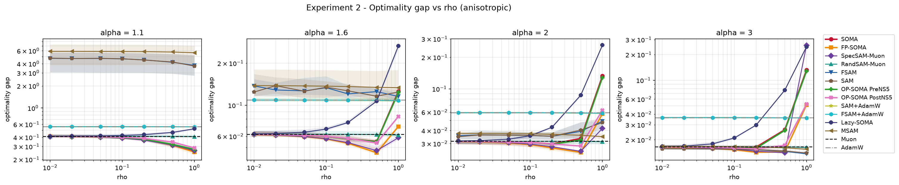

#### 8.1b Isotropic Noise

Median final gap `F − F*` at best stable ρ (0% divergence everywhere; `ridge: 0.01`, §5):

| Optimizer | `alpha=1.1` | `alpha=1.6` | `alpha=2` | `alpha=3` |
|---|---|---|---|---|
| SOMA | 0.630 | 0.176 | 0.0860 | 0.0486 |
| FP-SOMA | 0.654 | 0.147 | 0.0823 | 0.0413 |
| SpecSAM-Muon | 0.648 | **0.141** | **0.0733** | **0.0412** |
| RandSAM-Muon | 1.005 | 0.224 | 0.1082 | 0.0527 |
| FSAM | 6.582 | 0.753 | 0.2033 | 0.0517 |
| SAM | 6.542 | 0.735 | 0.2044 | 0.0526 |
| OP-SOMA-PreNS5 | 0.628 | 0.177 | 0.0855 | 0.0479 |
| OP-SOMA-PostNS5 | 0.717 | 0.162 | 0.0896 | 0.0450 |
| SAM+AdamW | **0.380** | 0.186 | 0.1354 | 0.0958 |
| FSAM+AdamW | 0.380 | 0.187 | 0.1370 | 0.0973 |
| Lazy-SOMA | 0.901 | 0.222 | 0.1110 | 0.0552 |
| MSAM | 8.976 | 1.005 | 0.2215 | 0.0552 |
| MSOMA | 0.991 | 0.227 | 0.1101 | 0.0526 |

**Takeaways:**
- **The heaviest-tail story is noise-structure-dependent, and this is the one place the two noise
  types genuinely disagree on a winner.** Under isotropic noise at `α=1.1`, `SAM+AdamW`/`FSAM+AdamW`
  **win outright** (0.380, beating every Muon-outer method's 0.63–1.0), the opposite of §8.1a's
  anisotropic result where the Muon-outer cluster wins and AdamW-outer sits in between. From `α=1.6`
  onward `SpecSAM-Muon` retakes the lead in both noise settings, so the AdamW-outer advantage is
  specific to the heaviest-tail, isotropic-noise corner of this grid — a genuine, data-grounded
  exception to §8.1a/§8.2's "Muon-outer wins the heaviest tail" pattern, not a contradiction to be
  explained away.
- **The SGD-outer blow-up is, if anything, worse here than under anisotropic noise:** `FSAM`/`SAM`/
  `MSAM` reach gaps of 6.5–9.0 at `α=1.1` (vs. 3.5–5.7 anisotropic), while every Muon-outer method
  stays in the same 0.6–1.0 range as its anisotropic counterpart. The outer-optimizer effect from
  §8.1a/§8.2 holds regardless of noise structure; its *magnitude* under the heaviest tail does not.

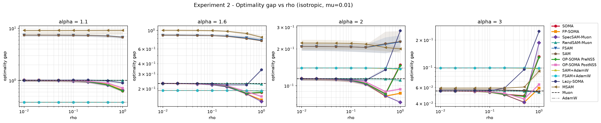

### 8.2 Nonlinear (NN Two-Matrix Classification) Heavy-Tailed Comparison

**What this tests.** The nonlinear counterpart of §8.1: `logits = W_2 · ReLU(W_1 x)` trained
against a same-shaped teacher with cross-entropy (`loss_type: nn_ce`), 512 training + 512 held-out
validation examples, run with `run.measure_alignment: true` so the same sweep also produces the
§8.3 cos-θ data below. Configs: `configs/nn_anisotropic_alignment.yaml` / `nn_isotropic_alignment.yaml`
(11 algorithms) plus their `_msam` companions (`MSAM`, `MSOMA`), same output directory, run strictly
sequentially. **0% divergence in every one of the 4,480 (anisotropic) + 4,480 (isotropic) final rows.**

#### 8.2a Anisotropic Noise

Validation accuracy (%) at best stable ρ:

| Optimizer | `alpha=1.1` | `alpha=1.6` | `alpha=2` | `alpha=3` |
|---|---|---|---|---|
| SOMA | 39.06 | 45.02 | **46.29** | 45.41 |
| FP-SOMA | 39.84 | 44.24 | **46.88** | 46.68 |
| SpecSAM-Muon | 37.40 | 43.65 | 46.29 | **46.97** |
| RandSAM-Muon | 37.89 | 42.29 | 44.34 | **44.82** |
| FSAM | 36.43 | 38.48 | 40.23 | **42.87** |
| SAM | 36.33 | 37.99 | 40.04 | **41.80** |
| OP-SOMA-PreNS5 | 38.77 | 45.31 | 46.09 | **46.39** |
| OP-SOMA-PostNS5 | 38.28 | 45.21 | **47.95** | 47.36 |
| SAM+AdamW | 28.91 | 41.60 | 44.14 | **46.00** |
| FSAM+AdamW | 28.71 | 41.70 | 44.34 | **46.29** |
| Lazy-SOMA | 37.89 | 41.31 | 41.41 | **41.80** |
| MSAM | 36.23 | 38.48 | 39.55 | **41.89** |
| MSOMA | 38.28 | 42.97 | **44.63** | 44.43 |

Training accuracy (%) at the same checkpoints:

| Optimizer | `alpha=1.1` | `alpha=1.6` | `alpha=2` | `alpha=3` |
|---|---|---|---|---|
| SOMA | 56.84 | 74.32 | 78.12 | **80.66** |
| FP-SOMA | 55.08 | 82.03 | 88.18 | **90.82** |
| SpecSAM-Muon | 51.07 | 77.25 | 83.50 | **85.64** |
| RandSAM-Muon | 57.71 | 92.29 | 98.34 | **99.80** |
| FSAM | 92.48 | 99.41 | **100.00** | **100.00** |
| SAM | 92.19 | 99.12 | **100.00** | **100.00** |
| OP-SOMA-PreNS5 | 56.15 | 75.78 | 80.76 | **83.89** |
| OP-SOMA-PostNS5 | 56.84 | 81.15 | 88.57 | **92.29** |
| SAM+AdamW | 36.91 | 61.82 | 71.29 | **77.64** |
| FSAM+AdamW | 36.91 | 62.01 | 71.88 | **75.68** |
| Lazy-SOMA | 57.52 | 71.19 | 74.41 | **77.44** |
| MSAM | 89.75 | 99.12 | 99.90 | **100.00** |
| MSOMA | 58.69 | 92.58 | 98.63 | **100.00** |

Validation loss at the same checkpoints:

| Optimizer | `alpha=1.1` | `alpha=1.6` | `alpha=2` | `alpha=3` |
|---|---|---|---|---|
| SOMA | 2.387 | 2.090 | **2.051** | 2.080 |
| FP-SOMA | 2.339 | 2.007 | 2.002 | **1.961** |
| SpecSAM-Muon | 2.381 | 2.008 | 1.977 | **1.930** |
| RandSAM-Muon | 2.483 | **2.346** | 2.499 | 2.699 |
| FSAM | 493.555 | 42.161 | 7.339 | **3.793** |
| SAM | 486.518 | 42.460 | 7.499 | **3.827** |
| OP-SOMA-PreNS5 | 2.395 | 2.112 | 2.058 | **2.050** |
| OP-SOMA-PostNS5 | 2.412 | 2.087 | **2.067** | 2.105 |
| SAM+AdamW | 2.924 | 2.075 | 1.983 | **1.933** |
| FSAM+AdamW | 2.927 | 2.075 | 1.980 | **1.924** |
| Lazy-SOMA | 2.487 | 2.168 | **2.161** | 2.246 |
| MSAM | 538.059 | 53.587 | 9.761 | **4.886** |
| MSOMA | 2.474 | **2.359** | 2.521 | 2.741 |

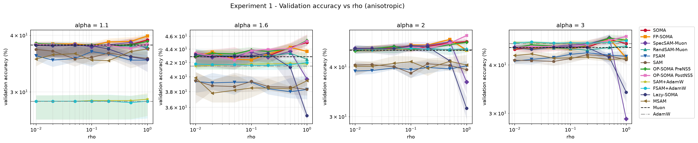
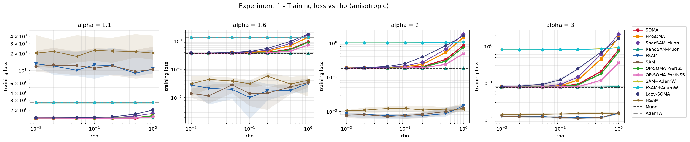

#### 8.2b Isotropic Noise

Validation accuracy (%) at best stable ρ:

| Optimizer | `alpha=1.1` | `alpha=1.6` | `alpha=2` | `alpha=3` |
|---|---|---|---|---|
| SOMA | 38.18 | 44.82 | **46.09** | 45.90 |
| FP-SOMA | 37.79 | 44.24 | **46.58** | 46.09 |
| SpecSAM-Muon | 36.43 | 44.24 | 45.21 | **46.19** |
| RandSAM-Muon | 36.04 | 42.87 | **44.92** | 44.14 |
| FSAM | 35.25 | 38.48 | 39.45 | **42.68** |
| SAM | 35.64 | 38.48 | 39.16 | **41.50** |
| OP-SOMA-PreNS5 | 38.57 | 44.24 | 45.70 | **46.48** |
| OP-SOMA-PostNS5 | 37.89 | 45.21 | 46.78 | **48.34** |
| SAM+AdamW | 40.82 | 43.16 | 44.34 | **45.31** |
| FSAM+AdamW | 40.82 | 43.16 | 44.63 | **46.19** |
| Lazy-SOMA | 36.23 | 41.70 | **41.99** | 39.84 |
| MSAM | 35.35 | 38.18 | 38.67 | **41.41** |
| MSOMA | 36.04 | 42.77 | **44.73** | 43.75 |

Training accuracy (%) at the same checkpoints:

| Optimizer | `alpha=1.1` | `alpha=1.6` | `alpha=2` | `alpha=3` |
|---|---|---|---|---|
| SOMA | 54.10 | 73.34 | 77.83 | **79.49** |
| FP-SOMA | 53.03 | 81.35 | 87.11 | **89.55** |
| SpecSAM-Muon | 50.00 | 77.54 | 83.30 | **84.77** |
| RandSAM-Muon | 53.81 | 89.16 | 97.66 | **99.61** |
| FSAM | 91.60 | 99.41 | 99.80 | **100.00** |
| SAM | 91.70 | 99.12 | 99.80 | **100.00** |
| OP-SOMA-PreNS5 | 52.64 | 73.93 | 79.79 | **82.32** |
| OP-SOMA-PostNS5 | 53.61 | 78.71 | 86.13 | **91.60** |
| SAM+AdamW | 52.44 | 66.99 | 72.56 | **76.95** |
| FSAM+AdamW | 52.44 | 66.60 | 71.88 | **75.29** |
| Lazy-SOMA | 53.32 | 69.73 | 72.46 | **76.56** |
| MSAM | 89.26 | 99.41 | **100.00** | **100.00** |
| MSOMA | 54.59 | 88.96 | 97.66 | **99.71** |

Validation loss at the same checkpoints:

| Optimizer | `alpha=1.1` | `alpha=1.6` | `alpha=2` | `alpha=3` |
|---|---|---|---|---|
| SOMA | 2.453 | 2.079 | **2.035** | 2.039 |
| FP-SOMA | 2.396 | 2.019 | 1.968 | **1.952** |
| SpecSAM-Muon | 2.427 | 2.008 | 1.969 | **1.946** |
| RandSAM-Muon | 2.578 | **2.244** | 2.364 | 2.593 |
| FSAM | 537.563 | 44.129 | 6.720 | **3.750** |
| SAM | 535.216 | 44.803 | 6.848 | **3.760** |
| OP-SOMA-PreNS5 | 2.485 | 2.086 | 2.062 | **2.036** |
| OP-SOMA-PostNS5 | 2.494 | 2.075 | **2.071** | 2.109 |
| SAM+AdamW | 2.275 | 2.029 | 1.963 | **1.937** |
| FSAM+AdamW | 2.275 | 2.029 | 1.963 | **1.930** |
| Lazy-SOMA | 2.586 | **2.144** | 2.156 | 2.249 |
| MSAM | 574.351 | 46.042 | 9.197 | **4.836** |
| MSOMA | 2.580 | **2.246** | 2.367 | 2.644 |

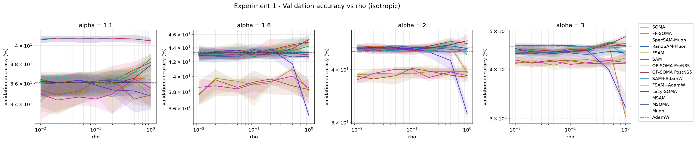
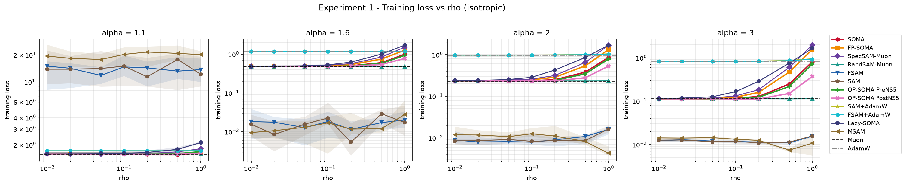

**Takeaways:**
- **The SGD-outer family (`SAM`, `FSAM`, `MSAM`) catastrophically overfits at `α=1.1`, and it is not
  divergence.** All three post 0% divergence yet a validation loss of 486–574 at `α=1.1` (both noise
  types), while training to 89–93% training accuracy. This is the harness's blow-up detector working
  exactly as intended — these runs never produce a non-finite weight — but the resulting classifier
  is confidently, catastrophically wrong on held-out data. Every other algorithm in the table,
  including the Muon-outer twin of the same perturbation (`MSOMA` vs `MSAM`), lands at a val loss
  around 2.4–2.6 at the same `α`. **It is the outer optimizer, not the perturbation source, that
  determines robustness here** — `MSAM`→`MSOMA` is a pure outer-optimizer swap (§6) and it alone
  closes a 500+ point val-loss gap.
- **AdamW-outer SAM variants avoid that collapse without Muon's spectral geometry.** `SAM+AdamW` /
  `FSAM+AdamW` post val loss 2.27–2.93 at `α=1.1` — far below the SGD-outer family's 486–574, even
  though both are still Frobenius-geometry SAM. AdamW's per-parameter adaptive scaling is evidently
  enough on its own to prevent the worst heavy-tailed blow-up, independent of Muon's spectral
  normalization — but it does not match Muon-outer validation *accuracy* at the heaviest tail
  (28–29% anisotropic vs 36–39% for the Muon family), so AdamW buys stability, not the accuracy edge.
- **Among Muon-outer methods, the friendly/stale-spectral family (`SOMA`, `FP-SOMA`, `OP-SOMA-*`,
  `SpecSAM-Muon`) clusters tightly at the top of validation accuracy across every `α`**, with
  `OP-SOMA-PostNS5` winning outright at `α=2.0`/anisotropic (47.95%) and `α=3.0`/isotropic (48.34%).
  `Lazy-SOMA` (the cheapest, single-pass, no-spectral-refresh method) and `RandSAM-Muon`/`MSOMA`
  (no gradient information in the perturbation at all) trail this cluster by 2–6 accuracy points at
  every `α`, a small but consistent cost for the cheaper or information-free perturbation.
- **Noise structure (isotropic vs. anisotropic) moves validation accuracy by at most ~2 points for
  every algorithm at every `α`** — far smaller than the 5–10 point swings driven by `α` itself. This
  mirrors the cos-θ finding in §8.3 below: tail-heaviness, not the noise's directional structure, is
  what mainly governs behavior in this testbed.

### 8.3 Perturbation Alignment: cos(θ) Between the SAM Perturbation and the Gradient / Momentum

**What this measures and why.** A SAM-type step perturbs the weights by some direction `ε_t`, then takes a gradient at the perturbed point. For stale/friendly/lookahead
sources, `ε_t` is built from old or momentum-derived information rather than a fresh gradient —
this measures how *aligned* that perturbation direction actually is with (a) the clean gradient
`g_t` and (b) the optimizer's own momentum buffer `v_t`, at the exact instant the perturbation is
applied. `cos(θ) = 1` means the perturbation points exactly along that reference vector (`θ=0°`);
`cos(θ) = -1` means exactly opposite (`θ=180°`); `cos(θ) ≈ 0` means uncorrelated (`θ≈90°`).

**Implementation.** An opt-in `run.measure_alignment` flag (default off, costs one extra oracle
call per logged step for non-`grad` sources) threads through `Engine.step()`: it captures `g_t` and
`v_t` at the moment `ε_t` is computed — before the outer optimizer's own update mutates the
momentum buffer — and records `total_cosine(ε_t, g_t)` / `total_cosine(ε_t, v_t)` (a multi-layer
cosine over the concatenated Frobenius inner product, `linalg.py`), NaN when either vector has zero
norm. This is safe to enable without perturbing training: `Oracle.gradients` is a pure, deterministic
function of `(weights, pre-drawn sample)`, so the extra call never changes the trajectory, only logs
an extra number. §8.2's alignment sweeps turn this on for all 13 curated algorithms.

Per algorithm/α/ρ, the CSVs below report the across-seed central tendency and IQR of the per-seed
final-step cosine (8 seeds; for an algorithm with both `frobenius_modes`, only the `global` mode is
used, never pooled with `per-layer` — pooling the two would silently double the effective seed
count), plus `theta_degrees = arccos(center cos θ)` for a more intuitive angle reading.

- `results/heavytailed_figures_preview/cos_pert_grad_by_rho.csv` /
  `cos_pert_grad_by_rho_isotropic.csv` — perturbation vs. gradient.
- `results/heavytailed_figures_preview/cos_pert_momentum_by_rho.csv` /
  `cos_pert_momentum_by_rho_isotropic.csv` — perturbation vs. momentum.

**Central-tendency statistic.** The default (and every plot embedded below) uses the **median**,
matching every other table in this README. `synthetic_ablations/cos_theta_stats.py` (the generator
for every cos-θ CSV/plot in this section) takes `--stat {median,mean,mode}`; `mean` is the ordinary
average, and `mode` is the **half-sample mode** (Bickel & Frühwirth 2006) — with only 8 seeds, a
density/KDE mode would be bandwidth-dependent and arbitrary, whereas the half-sample mode is
deterministic and needs no tuning parameter (recursively keep whichever half of the sorted sample
is most tightly clustered until 1–2 points remain). Running

```
python synthetic_ablations/cos_theta_stats.py <finals.csv> results/heavytailed_figures_preview \
  --stat mean --noise-label anisotropic   # or: --stat mode / --noise-label isotropic
```

writes the same six file types again under an explicit `_mean`/`_mode` suffix (e.g.
`cos_pert_grad_by_rho_mean.csv`, `vector_angle_grad_mode_isotropic.png`) rather than overwriting the
median files — all three statistics are published side by side in
`results/heavytailed_figures_preview/`, not just median.

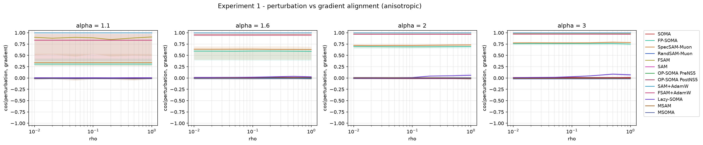
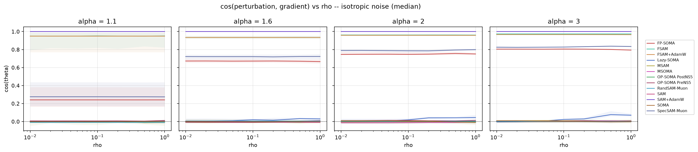
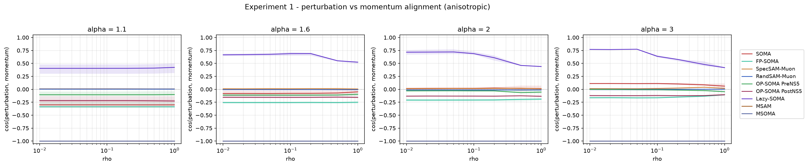
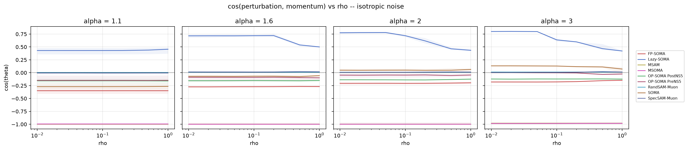

The line plots above are hard to read as literal angles (a flat line at `cos θ=0.3` doesn't
intuitively read as "72°"), so the same data is also rendered as a polar compass diagram at a fixed
ρ=0.2: a bold black reference arrow at 0° (the gradient or momentum direction), one colored arrow
per algorithm at `θ=arccos(median cos θ)`, and a shaded wedge spanning the IQR.

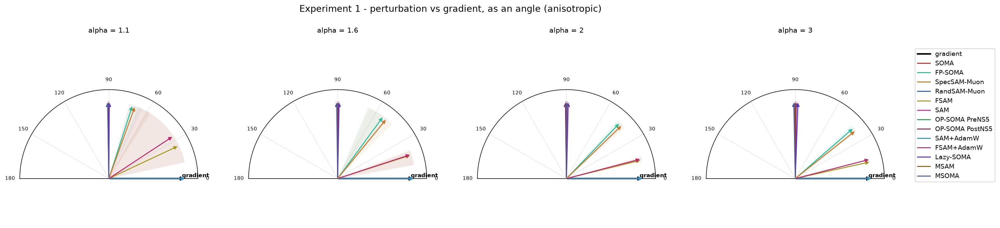
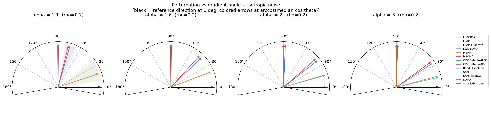
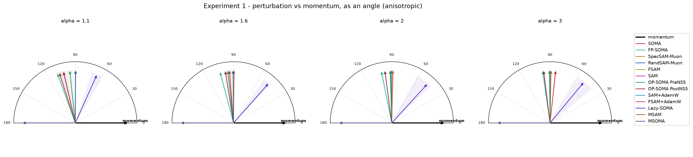
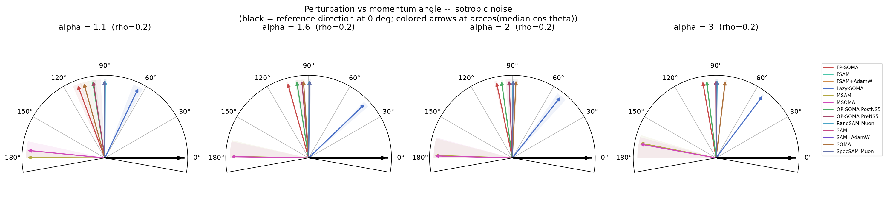

**Takeaways:**
- **Two built-in sanity checks pass, which validates the measurement itself.** `SAM`/`SAM+AdamW`
  perturb with the fresh gradient itself, so `cos(ε, g) = 1.000` (0°) at every α/ρ in both noise
  settings, exactly as it must by construction. `RandSAM-Muon` perturbs with an independent Gaussian
  direction, so `cos(ε, g) ≈ 0` (±0.01, i.e. ≈90°) everywhere — a random direction really is
  uncorrelated with the gradient, as it should be.
- **`MSAM`/`MSOMA` perturb almost exactly opposite their own momentum (`cos(ε, v) ≈ -1.000`, i.e.
  `θ≈180°`), confirming the lookahead sign is implemented correctly** (`ε = -ρ·v/‖v‖`, §6). This
  is also an independent confirmation of the sign-bug fix made earlier in this project (the first
  synthetic implementation of MSAM mistakenly reused the ascent-style `stale_momentum` source, which
  this exact measurement would have shown as `cos(ε, v) ≈ +1` instead — it would have caught the bug
  immediately had it existed when the fix was made).
- **The stale/friendly/spectral family's alignment with the gradient grows substantially as the tail
  lightens.** `SOMA`'s `cos(ε, g)` rises from ≈0.24–0.31 at `α=1.1` to ≈0.75–0.83 at `α=3.0`
  (both noise types); `SpecSAM-Muon` and `FP-SOMA` show the same pattern, rising from ≈0.27–0.34 to
  ≈0.78–0.83. Reading: under the heaviest tails, even a single clean gradient sample is so corrupted
  by rare extreme values that a stale or bias-corrected direction has little in common with the
  *next* instantaneous gradient (also corrupted, independently); as the tail lightens, individual
  gradients stabilize and the correlation climbs.
- **Does noise *structure* (isotropic vs. anisotropic), not just its tail-heaviness, affect cos(θ)?
  Mostly only slightly — with two honest exceptions.** Holding ρ=0.2 fixed and comparing the two
  noise settings directly, 9 of the 13 algorithms differ by under 0.03 (`SAM`, `SAM+AdamW`: ≈0;
  `RandSAM-Muon`, `MSAM`, `MSOMA`, `SOMA`, `OP-SOMA-PreNS5`, `OP-SOMA-PostNS5`, `Lazy-SOMA`: 0.01–0.03),
  far smaller than the α-driven swings for the same algorithms (often 0.4–0.5, e.g. `SpecSAM-Muon`
  spans 0.34→0.78 across α with only a 0.08 max iso/aniso gap at any fixed α). **`FSAM` and
  `FSAM+AdamW` are the exception:** their `cos(ε, g)` differs by 0.10–0.11 between noise types at
  `α=1.1` specifically (`FSAM+AdamW`: 0.835 anisotropic vs. 0.949 isotropic) — comparable in size to
  their *own* α-driven range (0.13), not 5–10× smaller. Both are the two curated algorithms with no
  Muon involvement at all (SGD/AdamW outer, Frobenius geometry, fresh friendly gradient, no
  staleness) and both are also the pair that catastrophically overfits at `α=1.1` under anisotropic
  noise (§8.2a) — a regime change that plausibly makes their gradient direction behave differently
  enough that it's no longer safe to call the noise-structure effect "negligible" for this pair
  specifically. **Conclusion: tail-heaviness (α) is still the dominant driver of cos(θ) for most of
  the curated set, and noise structure's effect is small-to-negligible there — but this is not
  universal, and `FSAM`/`FSAM+AdamW` are a genuine, data-grounded counterexample**, not noise to be
  averaged away.
